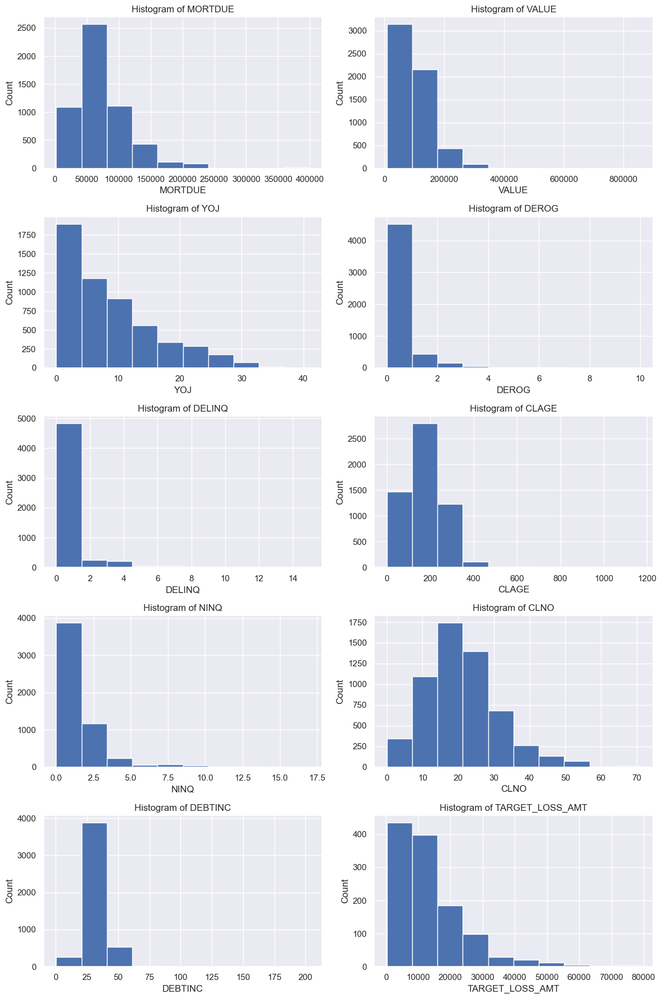

# Creating Predictive Models for Assessing the Risk of Home Equity Loans Using Machine Learning
**Author:** Stefan Jenss

-----------------------

# 1. Project and Dataset Overview

## 1.1 Project Objective
- The overall objective of this project is to used a home equity dataset to develop predictive models that can be used to determine the level of risk for each loan in a dataset of Home Equity (HMEQ) Loans.
- Both classification and regression predictive models will be created using various machine learning techniques, and the results of the techniques will be analyzed and compared to produce a final recommendation about which model type should ultimately be used to determine the risk of a loan will be made.

## 1.2 About the Dataset

### 1.2.1 What the Dataset Contains
As with all real world data, this data is far from perfect.

- It contains both numerical and categorical variables.
- It contains missing data.
- It contains outliers.

All of these aspects of the data will have to be addressed when creating the machine learning models.

### 1.2.2 Target Variables for the HMEQ Dataset
The dataset contains two target variables that will be explored to evaluate the risk of loan default and the amount of money lost assuming the loan defaults:
1. The first, `TARGET_BAD_FLAG`, indicates whether or not the loan defaulted. If the value is set to 1, then the loan went bad and the bank last money. If the value is set to 0, the loan was repaid.
2. The second target, `TARGET_LOSS_AMT`, indicates the amount of money that was lost for loans that went bad.

The reamining variables contain information about the customer at the time that the loan was issued.

### 1.2.3 HMEQ Dataset Data Dictionary

| Variable        | Definition                                                                                          | Role   | Type     | Conventional Wisdom                                                                                                 |
|-----------------|-----------------------------------------------------------------------------------------------------|--------|----------|---------------------------------------------------------------------------------------------------------------------|
| TARGET_BAD_FLAG | BAD=1 (Loan was defaulted)                                                                         | TARGET | BINARY   | HMEQ = Home Equity Line of Credit Loan. BINARY TARGET                                                               |
| TARGET_LOSS_AMT | If loan was Bad, this was the amount not repaid.                                                    | TARGET | NUMBER   | HMEQ = Home Equity Line of Credit Loan. NUMERICAL                                                                   |
| LOAN            | HMEQ Credit Line                                                                                    | INPUT  | NUMBER   | The bigger the loan, the more risky the person                                                                       |
| MORTDUE         | Current Outstanding Mortgage Balance                                                                | INPUT  | NUMBER   | If you owe a lot of money on your current mortgage versus the value of your house, you are more risky.            |
| VALUE           | Value of your house                                                                                  | INPUT  | NUMBER   | If you owe a lot of money on your current mortgage versus the value of your house, you are more risky.            |
| REASON          | Why do you want a loan?                                                                              | INPUT  | CATEGORY | If you are consolidating debt, that might mean you are having financial trouble.                                      |
| JOB             | What do you do for a living?                                                                         | INPUT  | CATEGORY | Some jobs are unstable (and therefore are more risky)                                                               |
| YOJ             | Years on Job                                                                                        | INPUT  | NUMBER   | If you have been at your job for a while, you are less likely to lose that job. That makes you less risky.         |
| DEROG           | Derogatory Marks on Credit Record. These are very bad things that stay on your credit report for 7 years. | INPUT  | NUMBER   | Lots of Derogatories mean that something really bad happened to you (such as a bankruptcy) in your past.          |
| DELINQ          | Delinquencies on your current credit report.                                                        | INPUT  | NUMBER   | When you have a lot of delinquencies, you might be more likely to default on a loan.                                |
| CLAGE           | Credit Line Age (in months) is how long you have had credit.                                        | INPUT  | NUMBER   | If you have had credit for a long time, you are considered less risky than a new high school student.               |
| NINQ            | Number of inquiries. This is the number of times within the last 3 years that you went out looking for credit. | INPUT  | NUMBER   | Conventional wisdom is that if you are looking for more credit, you might be in financial trouble. Thus you are risky. |
| CLNO            | Number of credit lines you have (credit cards, loans, etc.).                                        | INPUT  | NUMBER   | People who have a lot of credit lines tend to be safe. However, if you have too many credit lines, you might be risky. |
| DEBTINC         | Debt to Income Ratio. Take the money you spend every month and divide it by the amount of money you earn every month. | INPUT  | NUMBER   | If your debt to income ratio is high then you are risky because you might not be able to pay your bills.              |

-----------------------

# 2. Data Preparation

## 2.1 Overall Inspection of the Data

| Column | Non-Null Count | Dtype |
| --- | --- | --- |
| TARGET_BAD_FLAG | 5960 | int64 |
| TARGET_LOSS_AMT | 1189 | float64 |
| LOAN | 5960 | int64 |
| MORTDUE | 5442 | float64 |
| VALUE | 5848 | float64 |
| REASON | 5708 | object |
| JOB | 5681 | object |
| YOJ | 5445 | float64 |
| DEROG | 5252 | float64 |
| DELINQ | 5380 | float64 |
| CLAGE | 5652 | float64 |
| NINQ | 5450 | float64 |
| CLNO | 5738 | float64 |
| DEBTINC | 4693 | float64 |
| RangeIndex: 5960 entries, 0 to 5959 |  |  |
| Data columns (total 14 columns): |  |  |
| dtypes: float64(10), int64(2), object(2) |  |  |

***Interpretations:***

- There are 14 variables in our dataset (2 target variables [`TARGET_BAD_FLAG` & `TARGET_LOSS_AMT`] and 12 other variables with information about the characteristics of the borrowers).
- There are 5960 entries in the dataset, and only two columns don't have any null/missing values (`TARGET_BAD_FLAG` and `LOAN`).
- All of the variable's data types appear to be assigned appropriately to what the variable represents.
- Two variables are objects (strings), and 12 are numerical (10 float & 2 integers).

## 2.2 Statistical Description of the Data

| Variable | count | mean | std | min | 25% | 50% | 75% | max |
| --- | --- | --- | --- | --- | --- | --- | --- | --- |
| TARGET_BAD_FLAG | 5960.0 | 0.199497 | 0.399656 | 0.000000 | 0.000000 | 0.000000 | 0.000000 | 1.000000 |
| TARGET_LOSS_AMT | 1189.0 | 13414.576955 | 10839.455965 | 224.000000 | 5639.000000 | 11003.000000 | 17634.000000 | 78987.000000 |
| LOAN | 5960.0 | 18607.969799 | 11207.480417 | 1100.000000 | 11100.000000 | 16300.000000 | 23300.000000 | 89900.000000 |
| MORTDUE | 5442.0 | 73760.817200 | 44457.609458 | 2063.000000 | 46276.000000 | 65019.000000 | 91488.000000 | 399550.000000 |
| VALUE | 5848.0 | 101776.048741 | 57385.775334 | 8000.000000 | 66075.500000 | 89235.500000 | 119824.250000 | 855909.000000 |
| YOJ | 5445.0 | 8.922268 | 7.573982 | 0.000000 | 3.000000 | 7.000000 | 13.000000 | 41.000000 |
| DEROG | 5252.0 | 0.254570 | 0.846047 | 0.000000 | 0.000000 | 0.000000 | 0.000000 | 10.000000 |
| DELINQ | 5380.0 | 0.449442 | 1.127266 | 0.000000 | 0.000000 | 0.000000 | 0.000000 | 15.000000 |
| CLAGE | 5652.0 | 179.766275 | 85.810092 | 0.000000 | 115.116702 | 173.466667 | 231.562278 | 1168.233561 |
| NINQ | 5450.0 | 1.186055 | 1.728675 | 0.000000 | 0.000000 | 1.000000 | 2.000000 | 17.000000 |
| CLNO | 5738.0 | 21.296096 | 10.138933 | 0.000000 | 15.000000 | 20.000000 | 26.000000 | 71.000000 |
| DEBTINC | 4693.0 | 33.779915 | 8.601746 | 0.524499 | 29.140031 | 34.818262 | 39.003141 | 203.312149 |

***Interpretations:***

- The median amount lost on a defaulted loan (`TARGET_LOSS_AMT`) was $11,003.00 (mean of $13,414.58)
- The median value of the loans (`LOAN`) is $16,300.00 (mean of $18,607.97), and the median amount of the mortgage still due is $65.019 (mean of $73,760.82)
- The average number of delinquencies (`DELINQ`) among the borrowing population is 0.25, with the highest number being 10.
- The median lines of credit (`CLNO`) among the borrowers is 20 (mean of 21.3)

## 2.3 Visual Exploration of the Inputs and Target Variables Using Graphs and Other Visualizations

### 2.3.1 Pie Charts of Categorical Variables

    
    
    

 

***Interpretations:***
- Most loans are being taken out for debt consolidation (65.9%), while 29.9% are being taken out for home improvement projects, and the remaining 4.2% don't have a recorded reason for the loan.
- Most borrowers have a job that doesn't fall into one of the dataset's defined titles (40.1%). The next most common job among barrowers is 'ProfExe' (21.4%), followed by those with office jobs (12.9%), managers (12.9%), self-employed (3.2%), Sales (1.8%), and 4.7% of barrowers don't have a job type specified (nan).
- 19.9% of borrowers defaulted on their loans (have a value of 1), and 80.1% of borrowers were good on their loans.

### 2.3.2 Histograms of Continuous Variables (Integer & Float)

***Interpretations:***
- The distribution of loan amounts is positively skewed.
- For the target variable `TARGET_LOSS_AMT`, the distribution of the amount of money lost on the defaulted loan is very positively skewed.
- The float type variables represent the amount still due on the barrow's mortgage, the value of the borrower's home, the years the borrower has held their job, the number of derogatory marks on the borrower's credit record, the number of delinquencies the borrower has, and the number of credit inquiries the borrower has all have distributions that are positively skewed.
- The float type variables representing the borrower's number of lines of credit, age of credit, and debt-to-income ratio are more normally distributed.

## 2.4 Explorting of Variables

### 2.4.1 Exploration of Categorical Variables Relationship to Target Variables

**<u>Class =  JOB (The borrower's occupation)</u>**

| JOB | Probability of Loan Default |
| --- | --- |
| Mgr | 0.233377 |
| Office | 0.131857 |
| Other | 0.231993 |
| ProfExe | 0.166144 |
| Sales | 0.348624 |
| Self | 0.300518 |

| JOB | Average Loss Amount |
| --- | --- |
| Mgr | 14141.536313 |
| Office | 13475.304000 |
| Other | 11570.102888 |
| ProfExe | 14660.966981 |
| Sales | 16421.447368 |
| Self | 22232.362069 |

***Observations***

- Those borrowers who work in sales have the highest probability of defaulting on a loan (0.348624), followed by those who are self-employed (0.300518). Additionally, self-employed borrowers tend to have the most significant default amount ($22,232.36), which is almost 6 thousand dollars higher than the next most significant job type (sales at $16,421.45)
- Borrowers who work office jobs are the least likely to default on their loans (0.131857), followed by those who are 'ProfExe' (0.166144). This likely indicates the stability of these jobs since borrowers in these professions are less likely to experience a situation where they can't repay their loans. Borrowers in these professions also tend to have relatively lower amounts lost upon default ($13,475.30 and $14,660); however, borrowers with the profession of 'Other' have the lowest average default amount at $11,570.10.

**<u>Class =  REASON (The reason the borrower took out the loan)</u>**

| REASON  | Probability of Loan Default |
|---------|-----------------------------|
| DebtCon | 0.189664                    |
| HomeImp | 0.222472                    |

| REASON  | Average Loss Amount |
|---------|---------------------|
| DebtCon | 16005.163758        |
| HomeImp | 8388.090909         |

***Observations***

- Those who take out a loan for home improvement purposes are slightly more likely to default on their loans; however, when these borrowers default, the amount they default on is almost half of that of borrowers who default on loans for debt consolidation ($8,388 vs. $16,005).

### 2.4.2 Exploration of Continuous (Numerical) Variables Relationship to Target Variables

**<u>Variable =  LOAN (The loan amount)</u>**

| TARGET_BAD_FLAG | Value of Loan |
|-----------------|---------------|
| 0               | 19028.107315 |
| 1               | 16922.119428 |
| Correlation with Loss Amount | 83.71% |

- Borrowers who don't default on their loans generally have a higher loan value ($19,082.11), and those who default on their loans have an average loan value of $16,922.12.
- The value of a borrower's loan is significantly correlated with the loss amount upon default (83.71%)

**<u>Variable =  MORTDUE (The borrower's current outstanding mortgage)</u>**

| TARGET_BAD_FLAG | Mortgage Due   |
|-----------------|----------------|
| 0               | 74829.249055   |
| 1               | 69460.452973   |
| Correlation with Loss Amount | 34.87% |

- The average mortgage amount for loans that did not default is $74,829.25; for loans that did default, the average mortgage amount is $69,460.45. There is a moderate correlation, 34.87%, between the amount of a borrower's mortgage still due and the amount lost when a loan defaults.

**<u>Variable = VALUE (The value of the borrower's house)</u>**

| TARGET_BAD_FLAG | Value of Home |
|-----------------|---------------|
| 0               | 102595.921018 |
| 1               | 98172.846227  |
|Correlation with Loss Amount | 36.69% |

- For loans that did not default, the average value of the borrower's home is $102,595.92; for loans that did default, the average value of the borrower's home is $98,172.85. There is a moderate correlation, 36.69%, between the value of a borrower's house and the amount lost when a loan defaults.

**<u>Variable = YOJ (The number of years the borrower has been at their job)</u>**

| TARGET_BAD_FLAG | YOJ |
|-----------------|-----|
| 0               | 9.15 |
| 1               | 8.03 |
| Correlation with Loss Amount | 1.76% |

- For loans that did not default, the average length on the job is 9.15; for loans that did default, the average length is 8.03. There is very little correlation, 1.76%, between a borrower's years on the job and the amount lost when a loan defaults.

**<u>Variable = DEROG (The number of derogatory marks on the borrower's credit record)</u>**

| TARGET_BAD_FLAG | DEROG |
|-----------------|-------|
| 0               | 0.134 |
| 1               | 0.708 |
| Correlation with Loss Amount | 9.53% |

- For loans that did not default, the borrowers had, on average, 0.25 derogatory marks on their credit record; for loans that did default, the borrowers had, on average, 0.71 derogatory marks on their record. There is little correlation, 9.53%, between the number of derogatory marks on a borrower's record and the amount lost when a loan defaults.
    - Those borrower with more derogatory marks on their records likely have much more difficulty getting larger loans, which might be why we don't see a higher correlation between the number of derogatory marks and the amount lost when a loan defaults.

**<u>Variable = DELINQ (The number of delinquencies on the borrower's credit report)</u>**

| TARGET_BAD_FLAG | DELINQ |
|-----------------|--------|
| 0               | 0.245  |
| 1               | 1.229  |
| Correlation with Loss Amount | 22.66% |

- For loans that did not default, the borrowers had, on average, 0.25 delinquencies on their credit report; for loans that did default, the borrowers had, on average, 1.23 delinquencies on their credit report. There is a slight correlation, 22.66%, between the number of delinquents on a borrower's credit report and the amount lost when a loan defaults.
    - It is interesting to note that the correlation for delinquencies is higher than for derogatory marks. This makes me wonder whether lenders should consider delinquents with a similar weight to derogatory marks when deciding how much to lend borrowers.

**<u>Variable = CLAGE (The age of the borrower's line of credit)</u>**

| TARGET_BAD_FLAG | CLAGE |
|-----------------|-------|
| 0               | 187.00 |
| 1               | 150.19 |
| Correlation with Loss Amount | 1.41% |

- For loans that did not default, the borrowers had, on average, a credit line age of 187.00. For loans that did default, the borrowers had, on average, a credit line age of 150.19. Despite the difference in credit line age between those who did and did not default, there is very little correlation, 1.41%, between the credit line age and the amount lost when a loan defaults.

**<u>Variable = NINQ (The number of credit inquiries the borrower has on their credit report within the last three years)</u>**

| TARGET_BAD_FLAG | NINQ |
|-----------------|------|
| 0               | 1.03 |
| 1               | 1.78 |
| Correlation with Loss Amount | 14.28% |

- For loans that did not default, the borrowers had, on average, 1.03 credit inquiries; for loans that did default, the borrowers had, on average, a slightly higher number of credit inquiries--1.78. There is only a slight correlation, 14.28%, between the number of credit inquiries on a borrower's credit report and the amount lost when a loan defaults.

**<u>Variable = CLNO (Number of lines of credit)</u>**

| TARGET_BAD_FLAG | CLNO |
|-----------------|------|
| 0               | 21.32 |
| 1               | 21.21 |
| Correlation with Loss Amount | 40.0% |

- For both the borrowers that did and did not default on their loans, their number of lines of credit was very similar (default = 21.21; good = 21.32); however, there is a moderate correlation, 40.0%, between a borrower's number of lines of credit and the amount lost when a loan defaults.

**<u>Variable - DEBTINC (The barrower's debt-to-income-ratio)</u>**

| TARGET_BAD_FLAG | DEBTINC |
|-----------------|---------|
| 0               | 33.25   |
| 1               | 39.39   |
| Correlation with Loss Amount | 37.77% |

- Among the borrowers who did not default on their loans, the average debt-to-income ratio was 33.25. On the other hand, among borrowers defaulting on their loans, the average debt-to-income ratio was 39.39. A moderate correlation, 37.77%, exists between the borrower's debt-to-income-ration and the amount lost when a loan defaults.

## 2.5 Data Preparation

### 2.5.1 Filling in Missing Data for Categorical Data
**We will use the second method of imputation discussed in the lectures (filling in missing with entries with the category "MISSING").

- The two categorical variables that were identified as having missing data were:
    1. REASON (The reason that the borrower is taking out the loan)
    2. JOB (What the borrower does for a living)

**<u>Missing Categorical Value Imputation for `REASON` variable:</u>**

> Original variable = REASON  
> HAS MISSING  
> New (imputed) variable = IMP_REASON  
> New (flag) variable = M_REASON  
> Variable REASON has this many missing 252  
> Variable IMP_REASON has this many missing 0  
>> IMP_REASON  
>> DebtCon    3928  
>> HomeImp    1780  
>> MISSING     252  
>> Name: IMP_REASON, dtype: int64  

**<u>Missing Categorical Value Imputation for `JOB` variable:</u>**

> Original variable = JOB  
> HAS MISSING  
> New (imputed) variable = IMP_JOB  
> New (flag) variable = M_JOB  
> Variable JOB has this many missing 279  
> Variable IMP_JOB has this many missing 0  
>> IMP_JOB  
>> MISSING     279  
>> Mgr         767  
>> Office      948  
>> Other      2388  
>> ProfExe    1276  
>> Sales       109  
>> Self        193  
>> Name: IMP_JOB, dtype: int64  

### 2.5.2 Perform Missing Value Imputation for Numerical Variables

It is my hunch that for the numerical variables, `VALUE`, `LOAN`, and `DEBTINC` it would be best to fill in the missing values with the median of the groups in the `JOB` class. This is because the value of a person's home is likely to be related to how much they make and what their job is.  

Therefore, it would make sense to fill in the missing values with the median of the group that the individual belongs to. The same logic applies to the `LOAN` variable--the more a person makes at their job, the more they will likely be able to barrow. I also believe that this same approach is appropriate for the `DEBTINC` variable.

For the rest of the numerical variables, I will fill in the missing values with the median of all entries within the field.

**<u>Missing Numerical Value Imputation for `VALUE` Based on `JOB` Class</u>**

> **Name: VALUE, dtype: float64**  
> **IMP_JOB**
>> | GROUP   | MEDIAN VALUE  |
>> |---------|---------------|
>> | MISSING |    78227.0    |
>> | Mgr     |   101258.0    |
>> | Office  |    89094.5    |
>> | Other   |    76599.5    |
>> | ProfExe |   110007.0    |
>> | Sales   |    84473.5    |
>> | Self    |   130631.0    |
> Original variable = VALUE  
> New (Flag) variable = M_VALUE  
> New (Imputed) variable = IMP_VALUE 

**<u>Missing Numerical Value Imputation for `LOAN` Based on `JOB` Class</u>**

> **Name: LOAN, dtype: float64**  
> **IMP_JOB**
>> | GROUP   | MEDIAN LOAN   |
>> |---------|---------------|
>> | MISSING |    13400.0    |
>> | Mgr     |    18100.0    |
>> | Office  |    16200.0    |
>> | Other   |    15650.0    |
>> | ProfExe |    17300.0    |
>> | Sales   |    14300.0    |
>> | Self    |    24000.0    |
> Original variable = LOAN  
> New (Flag) variable = M_LOAN  
> New (Imputed) variable = IMP_LOAN

**<u>Missing Numerical Value Imputation for `DEBTINC` Based on `JOB` Class</u>**

> **Name: DEBTINC, dtype: float64**  
> **IMP_JOB**
>> | GROUP   | MEDIAN DEBTINC |
>> |---------|---------------|
>> | MISSING |    30.311902  |
>> | Mgr     |    35.661118  |
>> | Office  |    36.158718  |
>> | Other   |    35.247328  |
>> | ProfExe |    33.378041  |
>> | Sales   |    35.764058  |
>> | Self    |    34.830194  |
> Original variable = DEBTINC  
> New (Flag) variable = M_DEBTINC  
> New (Imputed) variable = IMP_DEBTINC

**<u>`.info()` Table After Performing Missing Value Imputation of the Rest of The Numerical Variables</u>**
- Note that there are no more missing values.

| Column               | Non-Null Count | Dtype   |
|----------------------|----------------|---------|
| TARGET_BAD_FLAG      | 5960           | int64   |
| TARGET_LOSS_AMT      | 5960           | float64 |
| M_REASON             | 5960           | int64   |
| IMP_REASON           | 5960           | object  |
| M_JOB                | 5960           | int64   |
| IMP_JOB              | 5960           | object  |
| M_VALUE              | 5960           | int64   |
| IMP_VALUE            | 5960           | float64 |
| M_LOAN               | 5960           | int64   |
| IMP_LOAN             | 5960           | int64   |
| M_DEBTINC            | 5960           | int64   |
| IMP_DEBTINC          | 5960           | float64 |
| M_MORTDUE            | 5960           | int64   |
| IMP_MORTDUE          | 5960           | float64 |
| M_YOJ                | 5960           | int64   |
| IMP_YOJ              | 5960           | float64 |
| M_DEROG              | 5960           | int64   |
| IMP_DEROG            | 5960           | float64 |
| M_DELINQ             | 5960           | int64   |
| IMP_DELINQ           | 5960           | float64 |
| M_CLAGE              | 5960           | int64   |
| IMP_CLAGE            | 5960           | float64 |
| M_NINQ               | 5960           | int64   |
| IMP_NINQ             | 5960           | float64 |
| M_CLNO               | 5960           | int64   |
| IMP_CLNO             | 5960           | float64 |
| Range Index: 5960 entries, 0 to 5959 |
| Data columns (total 26 columns) |
| dtypes: float64(10), int64(14), object(2) |

### 2.5.3 Performing One Hot Encoding on the Categorical Variables