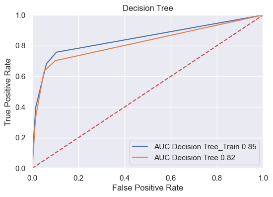
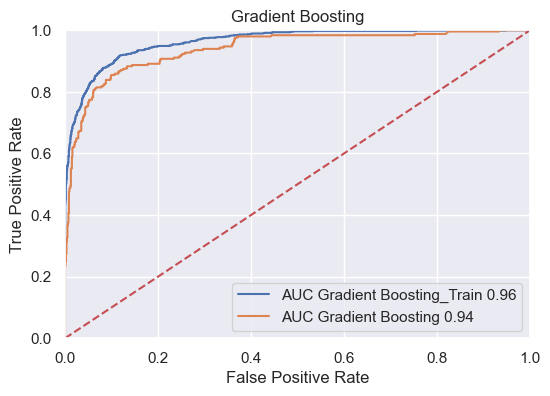
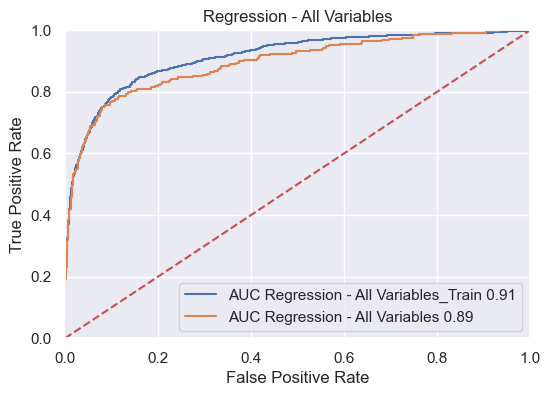
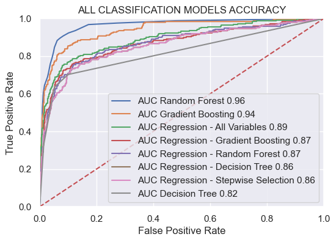

# Assignment 3 (Unit 3): Regression-Based Modules

**MSDS 422: Machine Learning**  
**Author:** Stefan Jenss  
**Instructor:** Donald Wedding, PhD  
**Date:** February 11th, 2023  

## Phase 1: Create a Training and Test Data Set

> Same as the previous assignment
> 
1. Splitting the Data
    - We created an 80/20% split of the data into training and test data.  
        
        > Output:  
        FLAG DATA  
        TRAINING =  (4768, 32)  
        TESTING =  (1192, 32)  
        > 
2. Handling of Outliers
For the handling of outliers for these models, we will consider outliers to be entries with a `TARGET_LOSS_AMT` value greater than $60,000.
    - Description of Test & Training Data *(Pre-Outlier-Handing):*
        
        
        | TRAINING | TARGET_BAD_FLAG | TARGET_LOSS_AMT | TEST | TARGET_BAD_FLAG | TARGET_LOSS_AMT |
        | --- | --- | --- | --- | --- | --- |
        | count | 941.0 | 941.000000 | count | 248.0 | 248.000000 |
        | mean | 1.0 | 13421.645058 | mean | 1.0 | 13387.758065 |
        | std | 0.0 | 10662.481428 | std | 0.0 | 11508.703991 |
        | min | 1.0 | 224.000000 | min | 1.0 | 320.000000 |
        | 25% | 1.0 | 5817.000000 | 25% | 1.0 | 5214.500000 |
        | 50% | 1.0 | 10959.000000 | 50% | 1.0 | 11336.500000 |
        | 75% | 1.0 | 17635.000000 | 75% | 1.0 | 16734.000000 |
        | max | 1.0 | 73946.000000 | max | 1.0 | 78987.000000 |
    - Description of the Test & Training Data *(Post-Outlier-Handling):*
        
        
        | TRAINING | TARGET_BAD_FLAG | TARGET_LOSS_AMT | TEST | TARGET_BAD_FLAG | TARGET_LOSS_AMT |
        | --- | --- | --- | --- | --- | --- |
        | count | 941.0 | 941.000000 | count | 248.0 | 248.000000 |
        | mean | 1.0 | 13400.475027 | mean | 1.0 | 13264.209677 |
        | std | 0.0 | 10558.757161 | std | 0.0 | 10902.351601 |
        | min | 1.0 | 224.000000 | min | 1.0 | 320.000000 |
        | 25% | 1.0 | 5817.000000 | 25% | 1.0 | 5214.500000 |
        | 50% | 1.0 | 10959.000000 | 50% | 1.0 | 11336.500000 |
        | 75% | 1.0 | 17635.000000 | 75% | 1.0 | 16734.000000 |
        | max | 1.0 | 60000.000000 | max | 1.0 | 60000.000000 |

---

## Phase 2: Evaluating The Previously Created M.L. Modules from Assignment 2

> We want to evaluate the previously created M.L. modules from Assignment 2 to compare their results to the Logistic Regression and Linear Regression modules we will create in this assignment.
>

### 2.1 Default Probability ROCs for the Previously Created ML Modules:

### 2.2 Default Probability Classification Accuracy Scores for the Previously Created ML Modules

| Accuracy Scores | Decision Tree | Random Forest | Gradient Boosting |
| --- | --- | --- | --- |
| Training Score | 0.8873741610738255 | 0.9997902684563759 | 0.9259647651006712 |
| Test Score | 0.8825503355704698 | 0.9161073825503355 | 0.9068791946308725 |
- For the previous ML models created, the **Random Forest** model performed the best at predicting the probability of default, with a 0.96 AUC and 0.916 accuracy score.

### 2.3 Amount Lost Assuming Default RMSE Scores for the Previously Created ML Modules

| RMSE Scores | Decision Tree | Random Forest | Gradient Boosting |
| --- | --- | --- | --- |
| Training Score | 4376.115301768929 | 1215.1036374284365 | 1216.8745387135345 |
| Test Score | 5300.687819418662 | 2725.840164535692 | 2272.6913845727468 |
- For the previous ML models created, the **Gradient Boosting** model best predicted the amount lost assuming default, with an RMSE score of 2272.7.

---

## Phase 3: Developing Logistic Regression

> We will evaluate logistic regression models using the following variable selection:
> - All Variable
> - Decision Tree Variables
> - Random Forest Variables
> - Gradient Boosting Variables
> - Stepwise Selection Variables

### 3.1 Default Probability ROCs for Logistic Regression Models:

### 3.2 Default Probability Accuracies for Logistic Regression Models:

| Variable Selection Method | Training Accuracy Score | Test Accuracy Score |
| --- | --- | --- |
| Regression - All Variables | 0.8934563758389261 | 0.889261744966443 |
| Regression - Decision Tree | 0.8754194630872483 | 0.8741610738255033 |
| Regression - Random Forest | 0.8798238255033557 | 0.8741610738255033 |
| Regression - Gradient Boosting | 0.8812919463087249 | 0.8800335570469798 |
| Regression - Stepwise Selection | 0.8754194630872483 | 0.8741610738255033 |

> Amoung the Logistic Regression Model the used, the Logistic Regression using Gradient Boosting variables was the most accurate, with an accuracy score of 0.88 and an AUC of 0.87. However, the previously created Random Forest model with an accuracy score of 0.916 and AUC of 0.96 still remains the most accurate model; therefore, I recommend the **Random Forest** model for predicting whether a loan will default.
>

### 3.2.1 Variables Used in Each Logistic Regression Model:

| Variable Selection Method | Variables Used |
| --- | --- |
| Regression - All Variables | All 33 variables were used for this model |
| Regression - Decision Tree | INTERCEPT, M_DEPTINC, IMP_DEBTINC, M_DEROG, IMP_DELINQ, IMP_CLAGE |
| Regression - Random Forest | INTERCEPT, M_DEBTINC, IMP_DEBTINC, IMP_DELINQ, IMP_CLAGE, IMP_LOAN, IMP_CALUE, IMP_CLNO, IMP_MORTDUE, IMP_YOJ, IMP_DEROG, IMP_NINQ |
| Regression - Gradient Boosting | INTERCEPT, M_DEBTINC, IMP_DEBTINC, IMP_DELINQ, IMP_CLAGE, M_VALUE, IMP_DEROG |
| Regression - Stepwise Selection | INTERCEPT, M_DEBTINC, IMP_DEBTINC, M_DEROG, IMP_DELINQ, IMP_CLAGE |

### 3.3 Examining Coefficients for Gradient Boosting Logistic Regression Model

There were **7** total variables used for the Logistic Regression Model using the **Gradient Boosting** variables
These included:

| Variable | Coefficient |
| --- | --- |
| INTERCEPT | -5.432779 |
| M_DEBTINC | 2.753325 |
| IMP_DEBTINC | 0.099528 |
| IMP_DELINQ | 0.646958 |
| IMP_CLAGE | -0.006143 |
| M_VALUE | 3.526238 |
| IMP_DEROG | 0.575937 |

All of the variables make sense for why they would predict whether a loan will default because they are likely indicators of fraud. The variables with the most significant coefficients are whether or not the person is missing a debt-to-income ratio and whether the value of the person’s own is missing. These two important values being missing are very suspicious, and these large coefficients support that. It also makes sense that as a borrower's number of credit delinquencies and derogatory marks increases, so does their likelihood of default. Additionally, it is unsurprising that the age of a borrower's credit line has a negative coefficient since the longer a person has a line of credit, the more experience they have managing debt.

---

## Phase 4: Developing Linear Regression

> We will evaluate linear regression models using the same variable selection methods as for the linear regression.
> 

### 4.1 Amount Lost Assuming Default RMSE Scores for Linear Regression Models:

| Variable Selection Method | Training RMSE Score | Test RMSE Score |
| --- | --- | --- |
| Regression - All Variables | 3578.3595491074625 | 3213.6502698249487 |
| Regression - Decision Tree | 4448.604572853346 | 4329.837423823597 |
| Regression - Random Forest | 4546.38193698269 | 4416.2363896732695 |
| Regression - Gradient Boosting | 4546.38193698269 | 4416.2363896732695 |
| Regression - Stepwise Selection | 4546.38193698269 | 4416.2363896732695 |

> Among the Linear Regression models created, the Linear Regression using the Decision Tree variables was the most accurate, with an RMSE Score of 4329.8. This is not surprising given that the decision tree linear regression model utilized the largest number of variables (6 versus 3 for all the others). Using a model with 6 variables is also much more feasible than a model with all 33 variables. However, the previously created **Gradient Boosting** model is still much more accurate than the Linear Regression using Decision Tree variables, with an RMSE score of 2272.7; therefore, I would recommend using the **Gradient Boosting** model for predicting the amount lost assuming default.
> 

### 4.1.1 Variables Used in Each Linear Regression Model:

| Variable Selection Method | Variables Used |
| --- | --- |
| Regression - All Variables | All 33 variables were used for this model |
| Regression - Decision Tree | INTERCEPT, IMP_LOAN, M_DEBTINC, IMP_NINQ, IMP_CLNO, z_IMP_REASON_DebtCon |
| Regression - Random Forest | INTERCEPT, IMP_LOAN, IMP_CLNO, M_DEBTINC |
| Regression - Gradient Boosting | INTERCEPT, IMP_LOAN, IMP_CLNO, M_DEBTINC |
| Regression - Stepwise Selection | INTERCEPT, IMP_LOAN, IMP_CLNO, M_DEBTINC |

### 4.2 Examining Coefficients for Decision Tree Linear Regression Model

There were **6** total variables used for the Linear Regression Model using the **Decision Tree** variables
These included:

| Variable | Coefficient |
| --- | --- |
| INTERCEPT | -4.889730 |
| M_DEBTINC | 2.819198 |
| IMP_DEBTINC | 0.092259 |
| M_DEROG | -0.803461 |
| IMP_DELINQ | 0.736207 |
| IMP_CLAGE | -0.006332 |

All of the variables included in the linear regression model using the Decision Tree variables make sense.

- Missing Debt-to-Income Ratio (2.82): It is suspicious if someone does not have this information, and thus, it makes sense that this has a large coefficient.
- Number of Delinquencies on Current Credit Report (0.74): It is unsurprising that someone with a large number of delinquencies would be more likely to lose a large amount upon default.
- Debt-to-Income Ratio (0.09): This makes sense; however, I'm surprised that this coefficient is not large; it would seem that someone with significantly more debt than income would have a more difficult time paying off the loan and thus would default on a large amount. We should consult with an industry expert regarding this.
- Missing Derogatory (-0.80): I would assume that if someone's number of derogatory marks is missing, that would indicate they likely don't have a history of derogatory marks, and thus this coefficient would make sense. Should consult with industry experts to confirm that this interpretation is correct.
- Credit Line Age (-0.01): I'm not surprised that this variable is included, and it makes sense that this coefficient would be negative for the reason previously stated in Section 3.3.
- NOTE: I am surprised to see that `LOAN` (The Home Equity Line of Credit Amount) is not included in the variables used to predict the amount lost upon default. It would make sense that the larger the line of credit, the larger the loss upon default. Consult an industry expert to see if the omission of this variable is appropriate.
