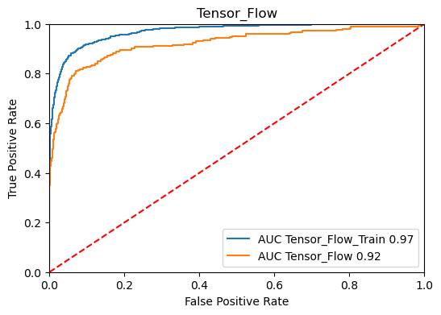
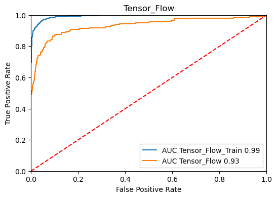
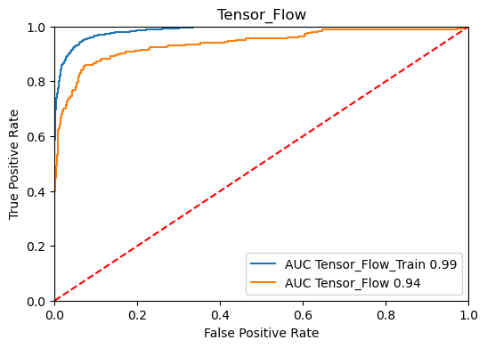
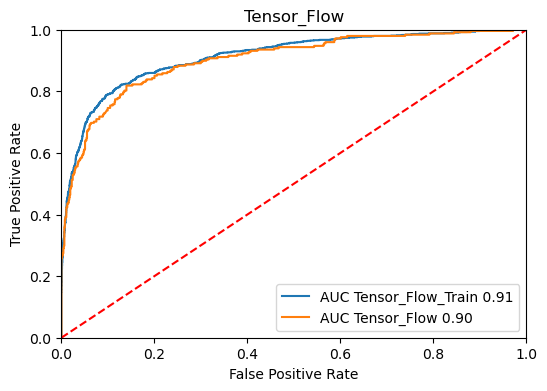
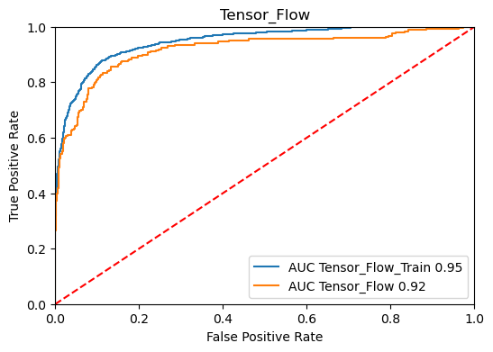

# Assignment 4 (Unit 4): Neural Networks (TensorFlow)

**MSDS 422: Machine Learning**  
**Author:** Stefan Jenss  
**Instructor:** Donald Wedding, PhD  
**Date:** March 10th, 2024  

## 1. Create a Training and Test Data Set

> Same as the previous assignment
> 
1. Splitting the Data
    - We created an 80/20% split of the data into training and test data.  
        
        > Output:  
        FLAG DATA  
        TRAINING =  (4768, 32)  
        TESTING =  (1192, 32)  
        > 
2. Handling of Outliers
For the handling of outliers for these models, we will consider outliers to be entries with a `TARGET_LOSS_AMT` value greater than $60,000.
    - Description of Test & Training Data *(Pre-Outlier-Handing):*
        
        
        | TRAINING | TARGET_BAD_FLAG | TARGET_LOSS_AMT | TEST | TARGET_BAD_FLAG | TARGET_LOSS_AMT |
        | --- | --- | --- | --- | --- | --- |
        | count | 941.0 | 941.000000 | count | 248.0 | 248.000000 |
        | mean | 1.0 | 13421.645058 | mean | 1.0 | 13387.758065 |
        | std | 0.0 | 10662.481428 | std | 0.0 | 11508.703991 |
        | min | 1.0 | 224.000000 | min | 1.0 | 320.000000 |
        | 25% | 1.0 | 5817.000000 | 25% | 1.0 | 5214.500000 |
        | 50% | 1.0 | 10959.000000 | 50% | 1.0 | 11336.500000 |
        | 75% | 1.0 | 17635.000000 | 75% | 1.0 | 16734.000000 |
        | max | 1.0 | 73946.000000 | max | 1.0 | 78987.000000 |
    - Description of the Test & Training Data *(Post-Outlier-Handling):*
        
        
        | TRAINING | TARGET_BAD_FLAG | TARGET_LOSS_AMT | TEST | TARGET_BAD_FLAG | TARGET_LOSS_AMT |
        | --- | --- | --- | --- | --- | --- |
        | count | 941.0 | 941.000000 | count | 248.0 | 248.000000 |
        | mean | 1.0 | 13400.475027 | mean | 1.0 | 13264.209677 |
        | std | 0.0 | 10558.757161 | std | 0.0 | 10902.351601 |
        | min | 1.0 | 224.000000 | min | 1.0 | 320.000000 |
        | 25% | 1.0 | 5817.000000 | 25% | 1.0 | 5214.500000 |
        | 50% | 1.0 | 10959.000000 | 50% | 1.0 | 11336.500000 |
        | 75% | 1.0 | 17635.000000 | 75% | 1.0 | 16734.000000 |
        | max | 1.0 | 60000.000000 | max | 1.0 | 60000.000000 |

----------------------------

## 2. TensorFlow Model to Predict Loan Default

### 2.1 Classification TensorFlow Models Using Varying Activation Functions

**<u>Description of the 3 Different Activation Function TensorFlow Models:</u>**
| Model   | Description                                       |
|---------|---------------------------------------------------|
| Model 1 | *One Hidden Layer w/ ReLU Activation Function*    |
| Model 2 | *One Hidden Layer w/ Sigmoid Activation Function* |
| Model 3 | *One Hidden Layer w/ Tanh Activation FUnction*    |

**<u>ROC Curves for the 3 Different Activation Function TensorFlow Models:</u>**
| Model 1 (ReLU)                   | Model 2 (Sigmoid)                | Model 3 (Tanh)                   |
|----------------------------------|----------------------------------|----------------------------------|
|  |  |  |    

**<u>Classification Accuracy for the 3 Different Activation Function TensorFlow Models:</u>**
| Model             | Training Accuracy | Test Accuracy | AUC    |
|-------------------|-------------------|---------------|--------|
| Model 1 (ReLU)    | 0.937             | 0.908         | 0.92   |
| Model 2 (Sigmoid) | 0.898             | 0.883         | 0.90   |
| Model 3 (Tanh)    | 0.914             | 0.898         | 0.91   |

> Out of the three activation functions tested, **ReLU** produced the best results, so we will proceed with this activation function for the hidden and dropped layer testing and variable selection testing.

### 2.2 Classification TensorFlow Models Using Varying Hidden and Dropped Layers

**<u>Description of the different classification models:</u>**
| Model       | Description                                                         |
|-------------|---------------------------------------------------------------------|
| Model 1     | *One Hidden Layer w/ ReLU Activation Function*                      |
| Model 2     | *One Hidden Layer w/ Sigmoid Activation Function*                   |
| Model 3     | *One Hidden Layer w/ Tanh Activation FUnction*                      |
| **Model 4** | *Two Hidden Layers w/ ReLU Activation Function*                     |
| **Model 5** | *Two Hidden Layers + One Dropped Layer w/ ReLU Activation Function* |

**<u>ROC Curves for the New Models & Comparison of All Tensorflow Classification Models:</u>**
| Model 1 (*1 Hidden & ReLU*)          | Model 4 (*2 Hidden & ReLU*)          | Model 5 (*2 Hidden & 1 Dropped & ReLU) |
|--------------------------------------|--------------------------------------|----------------------------------------|
|      |      |        |

**<u>Classification Accuracy for the Varying Hidden and Dropped Layer TensorFlow Models:</u>**=
| Model                                   | Training Accuracy | Test Accuracy | AUC    |
|-----------------------------------------|-------------------|---------------|--------|
| Model 1 (*1 Hidden & ReLU*)             | 0.937             | 0.908         | 0.92   |
| Model 4 (*2 Hidden & ReLU*)             | 0.973             | 0.917         | 0.93   |
| Model 5 (*2 Hidden & 1 Dropped & ReLU*) | 0.952             | 0.920         | 0.94   |

### 2.3 Comparing the Results from the 5 Classification TensorFlow Models Created Thus Far

**<u>ROC Curves of All 5 Models Created</u>**

> **Model 5**, which has 2 hidden layers and 1 dropped layer using the ReLU activation function, performs the best out of the 5 models created. Therefore, this is the model we will use in the next step for variable selection testing.

### 2.4 Exploring TensorFlow Classification Model Through Variable Selection Testing
The Variables selections that will be used include:
1. Decision Tree Variables
2. Random Forest Variables
3. Gradient Boosting Variables
> All variable selection tests will be applied to Model 5

**<u>ROC Curves for the Variable Selection TensorFlow Classification Models:</u>**
| Model 5 - Decision Tree Variables | Model 5 - Random Forest Variables | Model 5 - Gradient Boosting Variables |
|-----------------------------------|-----------------------------------|---------------------------------------|
|    |    |        |

**<u>Classification Accuracy for the Different Variable Selection TensorFlow Models:</u>**
| Model                                   | Training Accuracy | Test Accuracy | AUC    |
|-----------------------------------------|-------------------|---------------|--------|
| Model 5 - Decision Tree Variables       | 0.893             | 0.878         | 0.90   |
| Model 5 - Random Forest Variables       | 0.916             | 0.889         | 0.92   |
| Model 5 - Gradient Boosting Variables   | 0.903             | 0.897         | 0.92   |

**<u>ROC Curves of All 3 Variable Selection Methods:</u>**

----------------------

## 3. TensorFlow Model to Predict Loss Given Default

### 3.1 Regression TensorFlow Models to Predict Loan Default Amount Using Varying Activation Functions

**<u>Regression Accuracy for the 3 Different Activation Function TensorFlow Models:</u>**
| Model             | Training RMSE | Test RMSE     |
|-------------------|---------------|---------------|
| Model 1 (ReLU)    | 11342.7       | 10737.1       |
| Model 2 (Sigmoid) | 16977.1       | 16080.8       |
| Model 3 (Tanh)    | 16969.3       | 16073.2       |

> Out of the three activation functions tested, **ReLU** again produced the best results, so we will proceed with this activation function for the hidden and dropped layer testing and variable selection testing for the regression TensorFlow models.

### 3.2 Regression TensorFlow Models to Predict Loan Default Amount Using Varying Hidden and Dropped Layers

**<u>Regression Accuracy for the Varying Hidden and Dropped Layer TensorFlow Models:</u>**

| Model                                   | Training RMSE   | Test RMSE     |
|-----------------------------------------|-----------------|---------------|
| Model 1 (*1 Hidden & ReLU*)             | 11342.7         | 10737.1       |
| Model 4 (*2 Hidden & ReLU*)             |  4922.3         |  6309.0       |
| Model 5 (*2 Hidden & 1 Dropped & ReLU*) |  5085.2         |  6402.3       |

### 3.3 Comparing the Results from the 5 Regression TensorFlow Models Created Thus Far

| Model   | Accuracy Score      |
|---------|---------------------|
| Model 4 | 6308.992203455266   |
| Model 5 | 6402.3219995726895  |
| Model 1 | 10737.151033346185  |
| Model 3 | 16073.230150151237  |
| Model 2 | 16080.75033068635   |

> Model 4, which utilizes the ReLU activation function with 2 hidden layers, has the lowest RMSE score and thus performs the best. Therefore, we will use this model for the variable selection testing.

### 3.4 Exploring TensorFlow Regression Model Through Variable Selection Testing
The Variables selections that will be used include:
1. Decision Tree Variables
2. Random Forest Variables
3. Gradient Boosting Variables
> All variable selection tests will be applied to Model 4

**<u>Regression Accuracy for the Different Variable Selection TensorFlow Models:</u>**
| Model                                   | Training RMSE   | Test RMSE |
|-----------------------------------------|-----------------|-----------|
| Model 4 - All Variables                 | 4922.3          | 6309.0    |
| Model 4 - Decision Tree Variables       | 10289.0         | 10106.9   |
| Model 4 - Random Forest Variables       | 8461.1          | 8470.5    |
| Model 4 - Gradient Boosting Variables   | 8685.8          | 8670.7    |

> Besides including all variables, the best variable selection method for Model 4 is using **Random Forest Variables**.

## 4. Comparing All Classification and Regression Models

### 4.1 Comparing All Classification Models for Predicting the Probability of Loan Default

> Based on the results shown in the graph illustrating the ROC curves for all the Machine Learning classification models created thus far, the most accurate overall model is the **Random Forest Model**, with an Area Under the Curve (AUC) of 0.96. The next best model that doesn't use all the available variables is the *Gradient Boosting Model* (AUC = 0.94), followed by the *TensorFlow model using the Gradient Boosting Variables, two hidden layers, and one dropped later* (AUC = 0.92). Therefore, I recommend using a Random Forest model to predict the probability that a borrower will default on their loan.

### 4.2 Comparing All Regression Models for Predicting the Amount Lost Upon Loan Default

| Model                                           | Accuracy Score      |
|-------------------------------------------------|---------------------|
| Gradient Boosting                               | 3789.6429503942113  |
| Random Forest                                   | 4011.315812306893   |
| Regression - All Variables                      | 4288.014541011649   |
| Regression - Random Forest Variables            | 4665.7087337961075  |
| Regression - Gradient Boosting Variables        | 4665.7087337961075  |
| Regression - Decision Tree Variables            | 5223.300119525708   |
| TensorFlow - Model #4 (All Variables)           | 6308.992203455266   |
| Decision Tree                                   | 6324.31679426072    |
| TensorFlow - Model #4 (Random Forest Variables) | 8470.461517033104   |

> To predict the amount lost upon loan default, the most accurate overall model is the **Gradient Boosting Model**, with a Root Mean Squared Error (RMSE) score of 3789.6. The TensorFlow Regression Models perform poorly compared to all other Machine Learning models besides the Decision Tree model, with the TensorFlow model using Random Forest variables and two hidden layers performing the worst out of all models (RMSE = 8470.46).
