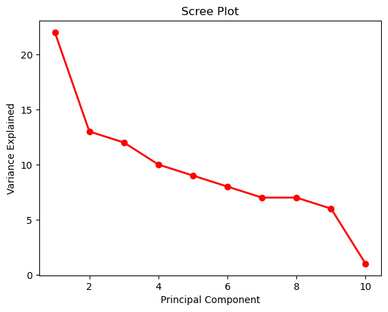
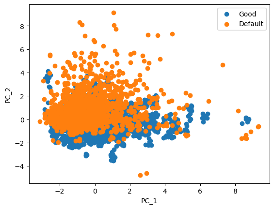
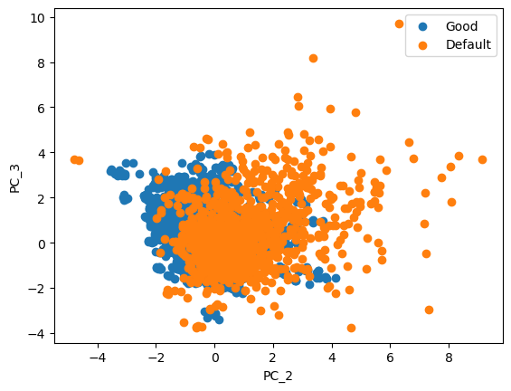

# Assignment 99 (Unit 99): Principal Component Analysis

**MSDS 422: Machine Learning**  
**Author:** Stefan Jenss  
**Instructor:** Donald Wedding, PhD  
**Date:** February 18th, 2023  

--------------------

## Phase 1: Assignment Setup

**<u>Missing Value Imputation Methods Used:</u>**
> For this assignment, I elected to use the same imputation methods I have been using in previous assignments for mental consistency with the data.
1. Fill in missing jobs with the category "MISSING"
2. Perform missing value imputation for "VALUE" based on the "JOB" class
3. Perform missing value imputation for "LOAN" based on the "JOB" class
4. Perform missing value imputation for "DEBTINC" based on the "JOB" class
5. Perform a general missing value imputation for the rest of the numeric variables based on the median values

**<u>`.head()` preview of the numeric-only Data Frame (missing value imputation completed):</u>**

| IMP_VALUE | IMP_LOAN | IMP_DEBTINC | IMP_MORTDUE | IMP_YOJ | IMP_DEROG | IMP_DELINQ | IMP_CLAGE | IMP_NINQ | IMP_CLNO |
|-----------|----------|-------------|-------------|---------|-----------|------------|-----------|----------|----------|
| 39025.0   | 1100     | 35.247328   | 25860.0     | 10.5    | 0.0       | 0.0        | 94.366667 | 1.0      | 9.0      |
| 68400.0   | 1300     | 35.247328   | 70053.0     | 7.0     | 0.0       | 2.0        | 121.833333| 0.0      | 14.0     |
| 16700.0   | 1500     | 35.247328   | 13500.0     | 4.0     | 0.0       | 0.0        | 149.466667| 1.0      | 10.0     |
| 78227.0   | 1500     | 30.311902   | 65019.0     | 7.0     | 0.0       | 0.0        | 173.466667| 1.0      | 20.0     |
| 112000.0  | 1700     | 36.158718   | 97800.0     | 3.0     | 0.0       | 0.0        | 93.333333 | 0.0      | 14.0     |

**<u>Description of the numeric-only Data Frame (missing value imputation completed):</u>**

|  **Statistic**  |    IMP_VALUE   |   IMP_LOAN  | IMP_DEBTINC | IMP_MORTDUE | IMP_YOJ | IMP_DEROG | IMP_DELINQ | IMP_CLAGE | IMP_NINQ | IMP_CLNO |
|------------|----------------|-------------|-------------|-------------|---------|-----------|------------|-----------|----------|----------|
|  **Count**  | 5960.000000    | 5960.000000| 5960.000000 | 5960.000000| 5960.000000 | 5960.000000 | 5960.000000 | 5960.000000 | 5960.000000 | 5960.000000 |
|  **Mean**  | 101553.336668  | 18607.969799 | 34.011474 | 73001.041812 | 8.756166 | 0.224329 | 0.405705 | 179.440725 | 1.170134 | 21.247819 |
|  **Std**  | 56906.419451   | 11207.480417 | 7.667363 | 42552.726779 | 7.259424 | 0.798458 | 1.079256 | 83.574697 | 1.653866 | 9.951308 |
|  **Min**  | 8000.000000    | 1100.000000 | 0.524499 | 2063.000000 | 0.000000 | 0.000000 | 0.000000 | 0.000000 | 0.000000 | 0.000000 |
|  **25%**  | 66489.500000   | 11100.000000 | 30.507400 | 48139.000000 | 3.000000 | 0.000000 | 0.000000 | 117.371430 | 0.000000 | 15.000000 |
|  **50%**  | 89094.500000   | 16300.000000 | 35.247328 | 65019.000000 | 7.000000 | 0.000000 | 0.000000 | 173.466667 | 1.000000 | 20.000000 |
|  **75%**  | 119144.750000  | 23300.000000 | 37.949892 | 88200.250000 | 12.000000 | 0.000000 | 0.000000 | 227.143058 | 2.000000 | 26.000000 |
|  **Max**  | 855909.000000  | 89900.000000 | 203.312149 | 399550.000000 | 41.000000 | 10.000000 | 15.000000 | 1168.233561 | 17.000000 | 71.000000 |

--------------------

## Phase 2: Principle Component Analysis

**<u>Eigen Values:</u>**
| Eigen       | Values      |
|-------------|-------------|
| 2.22390512  | 1.39807935  |
| 1.24113934  | 1.00193977  |
| 0.96209447  | 0.84962017  |
| 0.78261743  | 0.7182844   |
| 0.62915407  | 0.19484402  |

**<u>Summary of the Variance and Total Variance:</u>**
| Eigen  | Variation | Total |
|--------|-----------|-------|
| 2.22   | 22%       | 22%   |
| 1.4    | 13%       | 36%   |
| 1.24   | 12%       | 48%   |
| 1.0    | 10%       | 58%   |
| 0.96   | 9%        | 68%   |
| 0.85   | 8%        | 76%   |
| 0.78   | 7%        | 84%   |
| 0.72   | 7%        | 91%   |
| 0.63   | 6%        | 98%   |
| 0.19   | 1%        | 100%  |

**<u>Scree Plot of Eigen Values | Variance Explained | Total Variance Explained:</u>**

> **<u>Principal Component Selection:</u>**
>- Based on the scree plot, I will choose 4 principal components for the assignment.
>- This is because the eigenvalues and variance explained by the principal components level off after the 4th principal component.    
>- Additionally, the eigenvalues of the first 4 principal components are greater than 1.0, which is a common rule of thumb for selecting principal components.

**<u>Principle Component Data Frame:</u>**
|   IMP_VALUE  |  IMP_LOAN  | IMP_DEBTINC | IMP_MORTDUE |  IMP_YOJ  | IMP_DEROG | IMP_DELINQ | IMP_CLAGE | IMP_NINQ | IMP_CLNO |
|--------------|------------|-------------|-------------|-----------|-----------|------------|-----------|----------|----------|
|   0.584874   |  0.312647  |  0.175836   |  0.573248   | 0.035622  | -0.025728 |  0.052885  | 0.233939  | 0.045930 | 0.372932 |
|  -0.065912   | -0.074498  |  0.338365   |  0.006519   |-0.317499  |  0.496001 |  0.344196  |-0.347116  | 0.511857 | 0.166708 |
|  -0.186702   | -0.064637  | -0.067890   | -0.223311   | 0.512765  |  0.220450 |  0.525229  | 0.455348  |-0.033992 | 0.332563 |
|   0.011836   |  0.682006  | -0.023554   | -0.143423   | 0.463698  |  0.190154 |-0.161126  |-0.141836  | 0.337836 |-0.319713 |
|  -0.185375   | -0.069218  |  0.737136   | -0.161805   | 0.209851  | -0.491388 |-0.187641  | 0.062310  | 0.204019 | 0.158365 |
|   0.077544   |  0.179439  |  0.388963   |  0.019288   | 0.093382  | -0.000053 |  0.451666  |-0.365484  |-0.633180 |-0.250812 |
|  -0.121879   |  0.171297  |  0.321693   | -0.161425   |-0.227056  |  0.553366 |-0.447775  | 0.353939  |-0.366776 | 0.090502 |
|   0.188853   | -0.542847  |  0.075551   |  0.224025   | 0.555411  |  0.340291 |-0.326243  |-0.281603  |-0.057590 |-0.020635 |
|   0.164217   | -0.236428  |  0.213418   |  0.134019   |-0.059680  |  0.069083 |  0.175376  | 0.504499  | 0.199124 |-0.721364 |
|   0.707613   | -0.102364  |  0.004863   | -0.692927   |-0.060230  | -0.017813 |  0.000219  |-0.027765  | 0.023915 | 0.057854 |

**<u>Selected Principal Component Data Frame:</u>**
|       PC_1      |      PC_2      |      PC_3      |      PC_4      |
|-----------------|----------------|----------------|----------------|
|    -2.443934    |   -0.013382    |   -0.463002    |   -0.301693    |
|    -1.223679    |    0.409178    |    0.271007    |   -1.366127    |
|    -2.668941    |    0.080118    |   -0.452697    |   -0.781204    |
|    -0.998927    |   -0.264450    |   -0.204347    |   -1.097299    |
|    -0.567064    |    0.055936    |   -1.439306    |   -1.337581    |

--------------------

## Phase 3: Interpretation of the Principal Component

**<u>Results (Principal Component 1):</u>**

| Variable   | Coefficient |
|------------|-------------|
| IMP_VALUE  | 0.584874    |
| IMP_LOAN   | 0.312647    |
| IMP_DEBTINC| 0.175836    |
| IMP_MORTDUE| 0.573248    |
| IMP_YOJ    | 0.035622    |
| IMP_DEROG  |-0.025728    |
| IMP_DELINQ | 0.052885    |
| IMP_CLAGE  | 0.233939    |
| IMP_NINQ   | 0.045930    |
| IMP_CLNO   | 0.372932    |

**<u>Interpretation:</u>**
- Based on these values, we can interpret that the first principal component is most influenced by the features including `IMP_VALUE`, `IMP_MORTDUE`, and `IMP_CLNO`, which have coefficients of approximately 0.585, 0.573, and 0.373.
- These being the most influential features makes sense. With each of these features, the higher they are, the more debt and risk the borrowers have. As the value of the loan increases, the likelihood that the borrower won't have the money to repay it increases. Additionally, the larger a borrower's mortgage, the greater the chances that they prioritize making mortgage payments over loan payments.

--------------------

## Phase 4: Plots of the Principal Components

**<u>Scatter Plots of Selected Principal Components:</u>**

    

        
    

    

        
    

    

        
    

    

        
    

    

        
    

    

        
    

> None of the principal components plotted against each other predict the target variables well. However, out of the principal components plotted against each other, PC_1 and PC_2 were the best at predicting the target variables with the least amount of overlap between the two target variables.
