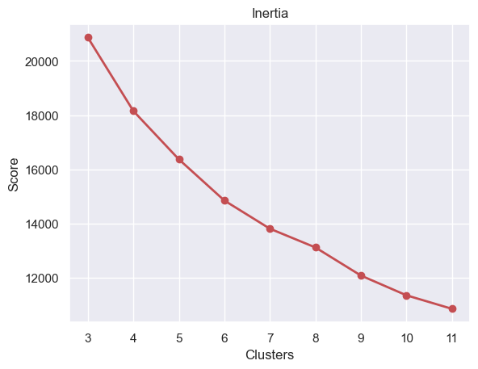
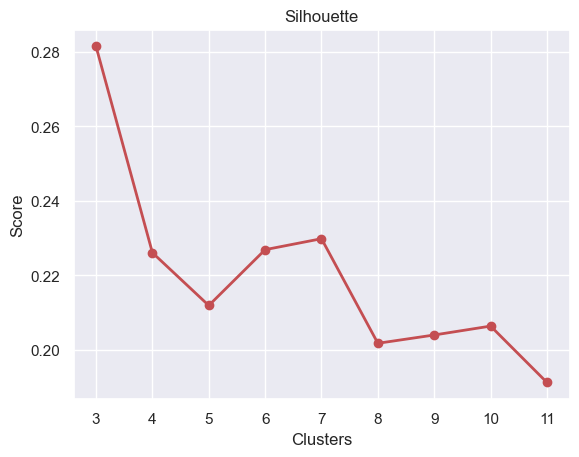
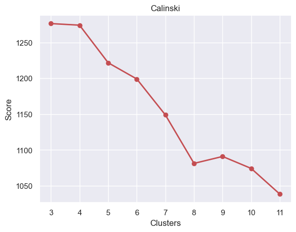

# Assignment 99 (Unit 99): KMeans Clustering

**MSDS 422: Machine Learning**  
**Author:** Stefan Jenss  
**Instructor:** Donald Wedding, PhD  
**Date:** March 10th, 2024  

--------------------

## Phase 1: Assignment Setup

**<u>Missing Value Imputation Methods Used:</u>**
> For this assignment, I elected to use the same imputation methods I have been using in previous assignments for mental consistency with the data.
1. Fill in missing jobs with the category "MISSING"
2. Perform missing value imputation for "VALUE" based on the "JOB" class
3. Perform missing value imputation for "LOAN" based on the "JOB" class
4. Perform missing value imputation for "DEBTINC" based on the "JOB" class
5. Perform a general missing value imputation for the rest of the numeric variables based on the median values

**<u>`.head()` preview of the numeric-only Data Frame (missing value imputation completed):</u>**

| IMP_VALUE | IMP_LOAN | IMP_DEBTINC | IMP_MORTDUE | IMP_YOJ | IMP_DEROG | IMP_DELINQ | IMP_CLAGE | IMP_NINQ | IMP_CLNO |
|-----------|----------|-------------|-------------|---------|-----------|------------|-----------|----------|----------|
| 39025.0   | 1100     | 35.247328   | 25860.0     | 10.5    | 0.0       | 0.0        | 94.366667 | 1.0      | 9.0      |
| 68400.0   | 1300     | 35.247328   | 70053.0     | 7.0     | 0.0       | 2.0        | 121.833333| 0.0      | 14.0     |
| 16700.0   | 1500     | 35.247328   | 13500.0     | 4.0     | 0.0       | 0.0        | 149.466667| 1.0      | 10.0     |
| 78227.0   | 1500     | 30.311902   | 65019.0     | 7.0     | 0.0       | 0.0        | 173.466667| 1.0      | 20.0     |
| 112000.0  | 1700     | 36.158718   | 97800.0     | 3.0     | 0.0       | 0.0        | 93.333333 | 0.0      | 14.0     |

**<u>Description of the numeric-only Data Frame (missing value imputation completed):</u>**

|  **Statistic**  |    IMP_VALUE   |   IMP_LOAN  | IMP_DEBTINC | IMP_MORTDUE | IMP_YOJ | IMP_DEROG | IMP_DELINQ | IMP_CLAGE | IMP_NINQ | IMP_CLNO |
|------------|----------------|-------------|-------------|-------------|---------|-----------|------------|-----------|----------|----------|
|  **Count**  | 5960.000000    | 5960.000000| 5960.000000 | 5960.000000| 5960.000000 | 5960.000000 | 5960.000000 | 5960.000000 | 5960.000000 | 5960.000000 |
|  **Mean**  | 101553.336668  | 18607.969799 | 34.011474 | 73001.041812 | 8.756166 | 0.224329 | 0.405705 | 179.440725 | 1.170134 | 21.247819 |
|  **Std**  | 56906.419451   | 11207.480417 | 7.667363 | 42552.726779 | 7.259424 | 0.798458 | 1.079256 | 83.574697 | 1.653866 | 9.951308 |
|  **Min**  | 8000.000000    | 1100.000000 | 0.524499 | 2063.000000 | 0.000000 | 0.000000 | 0.000000 | 0.000000 | 0.000000 | 0.000000 |
|  **25%**  | 66489.500000   | 11100.000000 | 30.507400 | 48139.000000 | 3.000000 | 0.000000 | 0.000000 | 117.371430 | 0.000000 | 15.000000 |
|  **50%**  | 89094.500000   | 16300.000000 | 35.247328 | 65019.000000 | 7.000000 | 0.000000 | 0.000000 | 173.466667 | 1.000000 | 20.000000 |
|  **75%**  | 119144.750000  | 23300.000000 | 37.949892 | 88200.250000 | 12.000000 | 0.000000 | 0.000000 | 227.143058 | 2.000000 | 26.000000 |
|  **Max**  | 855909.000000  | 89900.000000 | 203.312149 | 399550.000000 | 41.000000 | 10.000000 | 15.000000 | 1168.233561 | 17.000000 | 71.000000 |

--------------------

## Phase 2: Transform the Data

**<u>`.head()` preview of the transformed DataFrame:</u>**

| **Variable**        | **0**          | **1**          | **2**          | **3**          | **4**          |
|-----------------|------------|------------|------------|------------|------------|
| **trn_IMP_VALUE**   | -1.098885  | -0.582643  | -1.491228  | -0.409941  | 0.183592   |
| **trn_IMP_LOAN**    | -1.562299  | -1.544453  | -1.526606  | -1.526606  | -1.508759  |
| **trn_IMP_DEBTINC** | 0.161197   | 0.161197   | 0.161197   | -0.482550  | 0.280073   |
| **trn_IMP_MORTDUE** | -1.107920  | -0.069286  | -1.398407  | -0.187596  | 0.582831   |
| **trn_IMP_YOJ**     | 0.240237   | -0.241936  | -0.655226  | -0.241936  | -0.792990  |
| **trn_IMP_DEROG**   | -0.280976  | -0.280976  | -0.280976  | -0.280976  | -0.280976  |
| **trn_IMP_DELINQ**  | -0.375943  | 1.477341   | -0.375943  | -0.375943  | -0.375943  |
| **trn_IMP_CLAGE**   | -1.018026  | -0.689350  | -0.358680  | -0.071488  | -1.030391  |
| **trn_IMP_NINQ**    | -0.102879  | -0.707574  | -0.102879  | -0.102879  | -0.707574  |
| **trn_IMP_CLNO**    | -1.230878  | -0.728389  | -1.130380  | -0.125403  | -0.728389  |

**<u>Description of the transformed DataFrame:</u>**

| **Variable** | **count** | **mean** | **std** | **min** | **25%** | **50%** | **75%** | **max** |
|-----------------|--------|-----------------|----------|-----------|-----------|-----------|-----------|-----------|
| **trn_IMP_VALUE**   | 5960.0 | 3.814995e-17    | 1.000084 | -1.644124 | -0.616218 | -0.218954 | 0.309155  | 13.257185 |
| **trn_IMP_LOAN**    | 5960.0 | -1.525998e-16   | 1.000084 | -1.562299 | -0.669963 | -0.205948 | 0.418687  | 6.361645  |
| **trn_IMP_DEBTINC** | 5960.0 | -4.387244e-16   | 1.000084 | -4.367836 | -0.457050 | 0.161197  | 0.513703  | 22.082544 |
| **trn_IMP_MORTDUE** | 5960.0 | -9.537486e-17   | 1.000084 | -1.667202 | -0.584313 | -0.187596 | 0.357215  | 7.674628  |
| **trn_IMP_YOJ**     | 5960.0 | -1.192186e-16   | 1.000084 | -1.206280 | -0.792990 | -0.241936 | 0.446882  | 4.442025  |
| **trn_IMP_DEROG**   | 5960.0 | 1.371014e-17    | 1.000084 | -0.280976 | -0.280976 | -0.280976 | -0.280976 | 12.244215 |
| **trn_IMP_DELINQ**  | 5960.0 | 5.960929e-17    | 1.000084 | -0.375943 | -0.375943 | -0.375943 | -0.375943 | 13.523685 |
| **trn_IMP_CLAGE**   | 5960.0 | -2.098247e-16   | 1.000084 | -2.147250 | -0.742743 | -0.071488 | 0.570823  | 11.832239 |
| **trn_IMP_NINQ**    | 5960.0 | 3.576557e-17    | 1.000084 | -0.707574 | -0.707574 | -0.102879 | 0.501815  | 9.572237  |
| **trn_IMP_CLNO**    | 5960.0 | 5.722492e-17    | 1.000084 | -2.135358 | -0.627892 | -0.125403 | 0.477583  | 4.999982  |

--------------------

## Phase 3: Variable Selection

**<u>Variable Selection Methodology:</u>**
I will select my variables based on the results of the important variables included in the random forest model that I 
created in the Tree-Based Methods assignment. The reason for choosing the random forest model is that this model had the greatest
AUC and the greatest accuracy. I will select the top 5 important numeric variables in the model.

Selected Variables from the Important Random Forest Model Variables:
1. DEBTINC
2. CLAGE
3. DELINQ
4. LOAN
5. VALUE

--------------------

## Phase 4: Determining the Number of Clusters

**<u>Elbow Plots for the Inertia, Silhouette, and Calinski Harabaz Scores:</u>**

    
    
    

**<u>Interpretation:</u>**
1. **Inertia Plot**: There is a relatively smooth decrease throughout the inertia plot, without any apparent "elbow" shape. However, there is a slight change in the pattern of decline between 7 and 8 clusters. Therefore, the Initeria plot suggests that between 7-8 clusters is best.
2. **Silhouette Plot**: Since the higher the Silhouette score, the better the object is matched to its own cluster and worse to neighboring clusters, this Silhouette plot suggests that using 7 clusters is the best.
3. **Calinski-Harabasz Plot**: This plot shows a relatively steady decrease up until 7 clusters, followed by a sharp decrease after this. This likely suggests that up to 7 clusters is a viable number of clusters and likely indicates that more than 7 clusters is suboptimal.

> **Conclusion**: 7 clusters will be used.

--------------------

## Phase 5: Find the KMeans Clusters

K = 7

### <u>Preview of the data:</u>
| Variable          | 0         | 1         | 2         | 3         | 4         |
|-------------------|-----------|-----------|-----------|-----------|-----------|
| TARGET_BAD_FLAG   | 1         | 1         | 1         | 1         | 0         |
| TARGET_LOSS_AMT   | 641.0     | 1109.0    | 767.0     | 1425.0    | NaN       |
| IMP_REASON        | HomeImp   | HomeImp   | HomeImp   | MISSING   | HomeImp   |
| IMP_JOB           | Other     | Other     | Other     | MISSING   | Office    |
| IMP_VALUE         | 39025.0   | 68400.0   | 16700.0   | 78227.0   | 112000.0  |
| IMP_LOAN          | 1100      | 1300      | 1500      | 1500      | 1700      |
| IMP_DEBTINC       | 35.247328 | 35.247328 | 35.247328 | 30.311902 | 36.158718 |
| IMP_MORTDUE       | 25860.0   | 70053.0   | 13500.0   | 65019.0   | 97800.0   |
| IMP_YOJ           | 10.5      | 7.0       | 4.0       | 7.0       | 3.0       |
| IMP_DEROG         | 0.0       | 0.0       | 0.0       | 0.0       | 0.0       |
| IMP_DELINQ        | 0.0       | 2.0       | 0.0       | 0.0       | 0.0       |
| IMP_CLAGE         | 94.366667 | 121.833333| 149.466667| 173.466667| 93.333333 |
| IMP_NINQ          | 1.0       | 0.0       | 1.0       | 1.0       | 0.0       |
| IMP_CLNO          | 9.0       | 14.0      | 10.0      | 20.0      | 14.0      |
| CLUSTER           | 4         | 4         | 4         | 2         | 4         |

### <u>Means for each cluster:</u>
| CLUSTER           | 0              | 1              | 2              | 3              | 4              | 5              | 6              |
|-------------------|----------------|----------------|----------------|----------------|----------------|----------------|----------------|
| TARGET_BAD_FLAG   | 0.092561       | 0.135241       | 0.056696       | 0.672355       | 0.279223       | 0.143345       | 1.000000       |
| TARGET_LOSS_AMT   | 10217.345794   | 20943.278846   | 5705.534483    | 17735.852792   | 10585.579882   | 36396.547619   | 33836.800000   |
| IMP_VALUE         | 91882.236817   | 201563.576073  | 81585.128055   | 103053.252560  | 82422.541421   | 102829.296928  | 141897.000000  |
| IMP_LOAN          | 16396.280277   | 25503.641092   | 15056.011730   | 16723.208191   | 15249.277158   | 51012.969283   | 33920.000000   |
| IMP_DEBTINC       | 35.189942      | 36.160111      | 24.134981      | 34.870401      | 36.652627      | 33.582037      | 147.805911     |
| IMP_MORTDUE       | 64058.461185   | 142659.644993  | 59044.193548   | 73447.423311   | 62147.482875   | 62790.894198   | 110053.600000  |
| IMP_YOJ           | 10.658131      | 8.803121       | 8.943597       | 9.855290       | 7.508158       | 9.795904       | 2.400000       |
| IMP_DEROG         | 0.117647       | 0.166450       | 0.172043       | 0.689420       | 0.241223       | 0.375427       | 0.200000       |
| IMP_DELINQ        | 0.201557       | 0.101430       | 0.143695       | 4.262799       | 0.264354       | 0.215017       | 1.600000       |
| IMP_CLAGE         | 285.918421     | 198.315433     | 160.594692     | 187.324629     | 127.617790     | 196.226664     | 161.777832     |
| IMP_NINQ          | 1.100346       | 1.074122       | 0.718475       | 1.460751       | 1.330029       | 1.662116       | 1.200000       |
| IMP_CLNO          | 23.776817      | 25.747724      | 17.756598      | 26.641638      | 19.611731      | 19.713311      | 24.800000      |

### <u>Count for each cluster:</u>
| CLUSTER | TARGET_BAD_FLAG | Count | % Bad (Default)   |
|---------|-----------------|-------|-------------------|
| 0       | 0 (Good)        | 1049  | 90.74%            |
|         | 1 (Default/Bad) | 107   | 9.26%             |
| 1       | 0               | 665   | 86.48%            |
|         | 1               | 104   | 13.52%            |
| 2       | 0               | 965   | 94.33%            |
|         | 1               | 58    | 5.67%             |
| 3       | 1               | 197   | 67.24%            |
|         | 0               | 96    | 32.76%            |
| 4       | 0               | 1745  | 72.08%            |
|         | 1               | 676   | 27.92%            |
| 5       | 0               | 251   | 85.67%            |
|         | 1               | 42    | 14.33%            |
| 6       | 0               | 0     | 0.00%             |
|         | 1               | 5     | 100.0%            |

### <u>Interpretation:</u>

#### Overview of Cluster Characteristics:
1. **Cluster 0:**  This cluster is relatively safe, with only 9.26% of loans defaulting. This cluster is characterized by relatively low loss amounts upon default ($10,217). The values for IMP_VALUE ($91,882), IMP_LOAN ($16,396), IMP_DEBT (35.19), and IMP_MORTDUE ($64,058) suggest that these are moderate loans with moderate property values. The borrowers in this cluster had the largest average IMP_YOJ, which is likely an indicator of stable income and a reliable borrower. Also notable is that this cluster also has the largest IMP_CLAGE, which likely further contributes to these borrowers' being a relatively low-risk group.

2. **Cluster 1:** This is a moderately safe cluster, with a loan default percentage of 13.52%. The defining characteristics of this cluster are that they have the largest IMP_VALUE ($201,563), with the next highest being $141,897. Additionally, this cluster has the largest IMP_MORTDUE ($142,659). While this cluster is moderately safe, due to the large IMP_VALUE amount, this cluster has a relatively large average TARGET_LOSS_AMT value ($20,943), meaning that default in this cluster can be more costly.

3. **Cluster 2:** This is the safest cluster with the lowest percentage of bad loans (5.67%) and the lowest average TARGET_LOSS_AMT ($5,705). The borrowers in this cluster are categorized by smaller loan amounts (IMP_LOAN: $15,056), lower property values (IMP_VALUE: $81,585), and the lowest debt-to-income ratios (IMP_DEBTINC: 24.13). New borrowers with these characteristics are likely very low risk to the lender.

4. **Cluster 3:** Very different from the first 3 clusters, this cluster has a high percentage of loan default (67.24%), making it the 2nd most unsafe cluster. This cluster is characterized by a moderately high average loss amount upon default (TARGET_LOSS_AMT: $17.735); however, the most defining features of this cluster are having the highest average number of derogatory marks (IMP_DEROG: 0.689) and the highest average number of delinquencies (IMP_DELINQ: 4.26).

5. **Cluster 4:** While not quite as risky as Cluster 3, Cluster 4 also has a significant proportion of defaults (27.92%) with a moderate average loss amount upon default (TARGET_LOSS_AMT: $10,585). Surprisingly, Cluster 4 has a similar profile of characteristics to Cluster 2, which is the safest cluster; however, the most marked difference is that Cluster 4 has a significantly larger debt-to-income ratio than Cluster 2 (36.65 vs. 24.13).

6. **Cluster 5:** One of the most interesting clusters, Cluster 5 has a moderately low percentage of default (14.33%); however, it has the highest average loss amount upon default (TARGET_LOSS_AMT: $26,296). This indicates that while this is a relatively safe borrower cluster, they are significantly more costly when default does occur. This cluster is characterized by very high average IMP_VALUE ($102,829), paired with the highest average loan amount (IMP_LOAN: $51,012), but relatively low average mortgage amounts due (IMP_MORTDUE: $62,790). 

7. **Cluster 6:** Cluster 6 is unique in that it is very small (containing only five borrowers) but has a default rate of 100%. These borrowers have the second-highest average loss amount upon default (TARGET_LOSS_AMT: $33,837), indicating they are extremely costly. This small cluster is characterized by the highest IMP_VALUE ($141,897), a large average loan amount (IMP_LOAN: $33,920), and an extremely high average debt-to-income ratio (IMP_DEBTINC: 147.81). An interesting feature of this cluster is that they have the shortest average years on current job (IMP_YOJ: 2.4). This feature suggests that these borrowers might be individuals who recently started very high-paying yet unstable jobs that result in them taking on large amounts of debt that they are then unable to pay off when they lose the high-paying job.

> **<u>Application of these clusters:</u>**
Given the unique characteristics of each cluster described above in the overview, these clusters could be used to determine the probability of loan default and the probable loss amount given default. New borrower's information could be compared to the characteristic profiles of the clusters outlined above, and such comparison could shed light on the potential risk of a new borrower.

