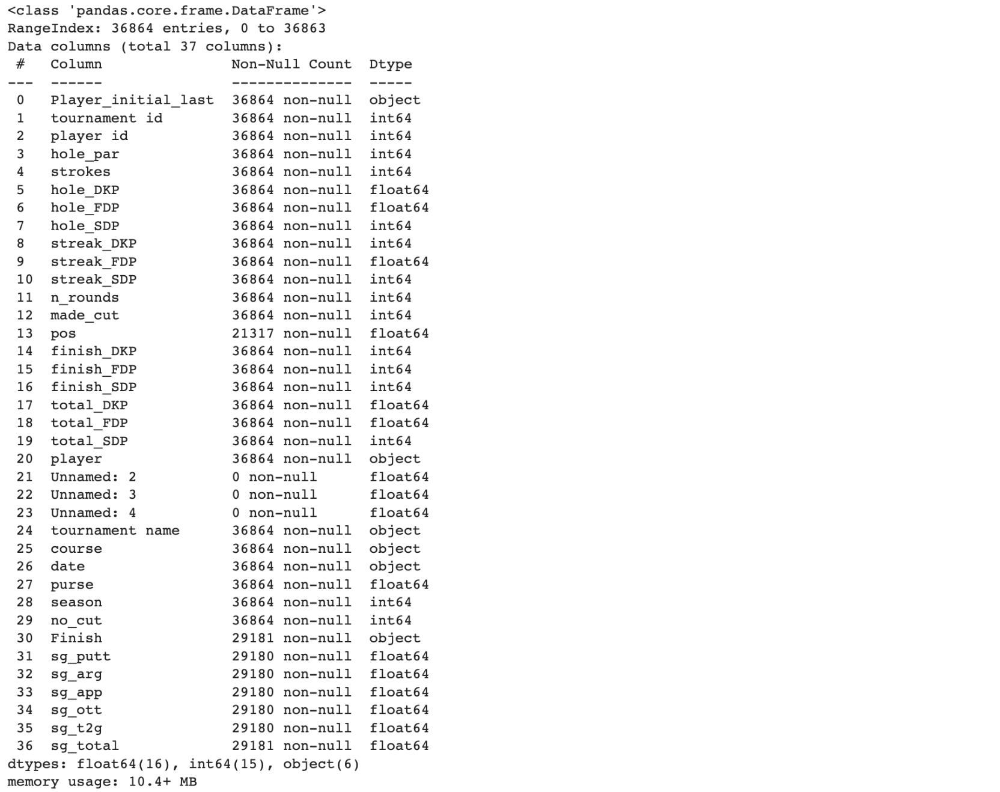
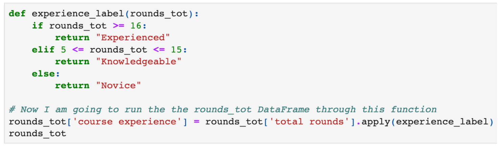
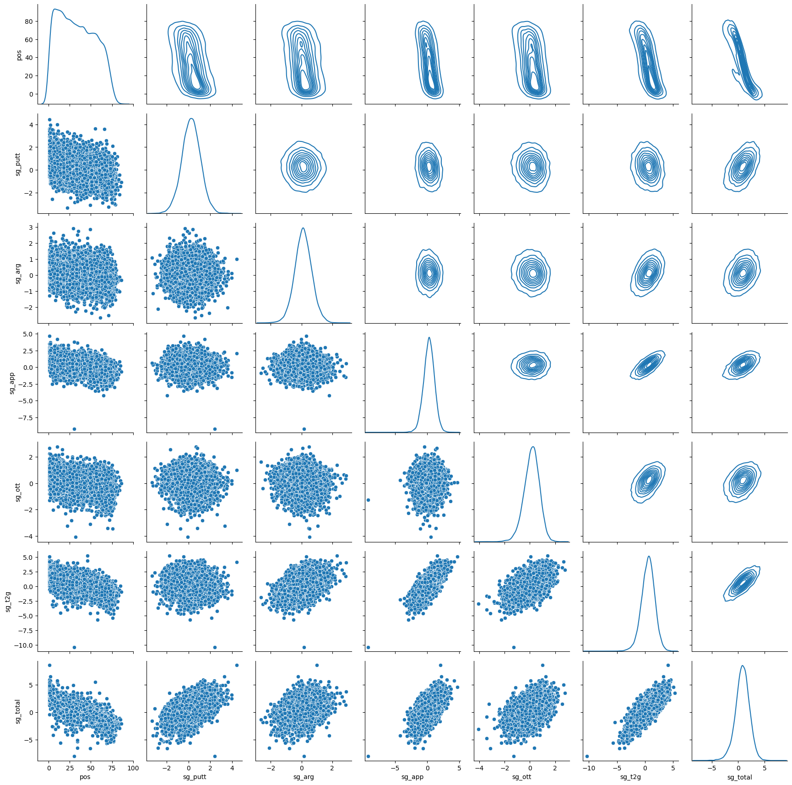
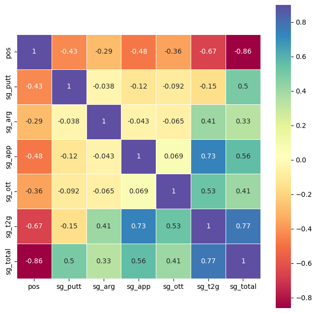
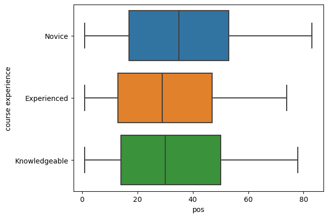
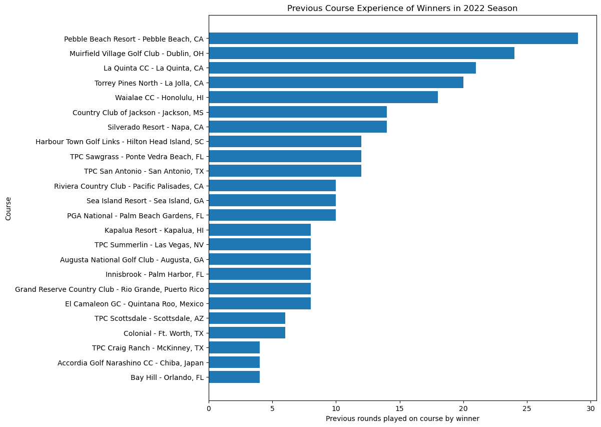
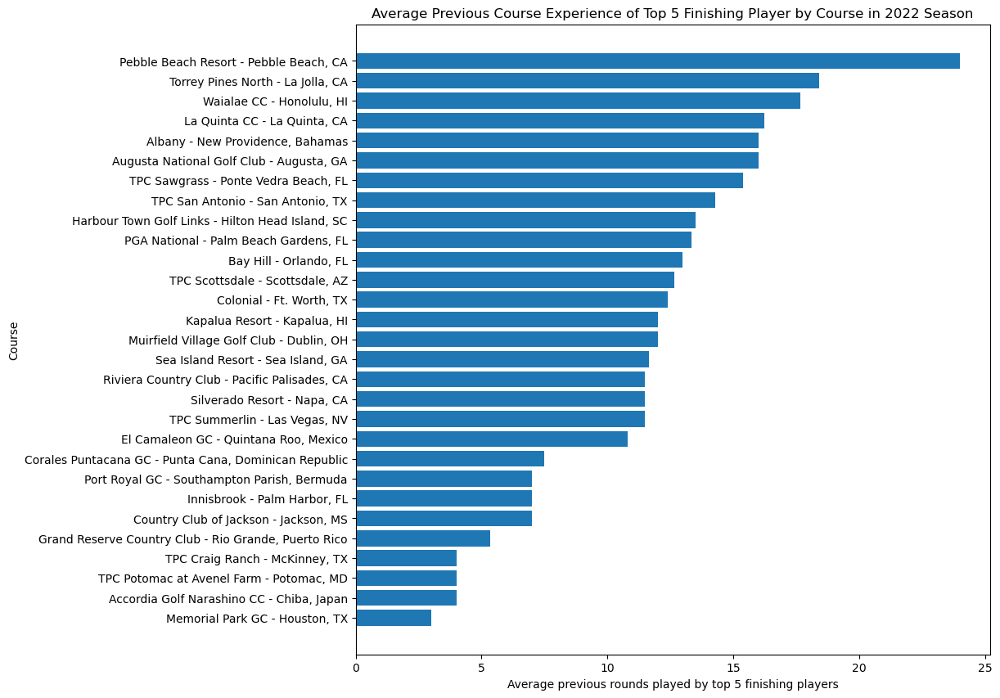
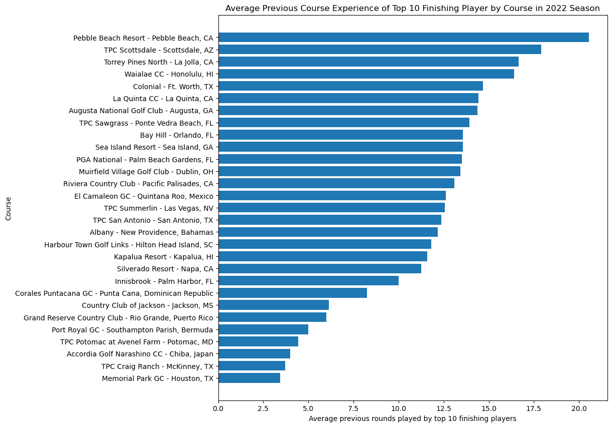
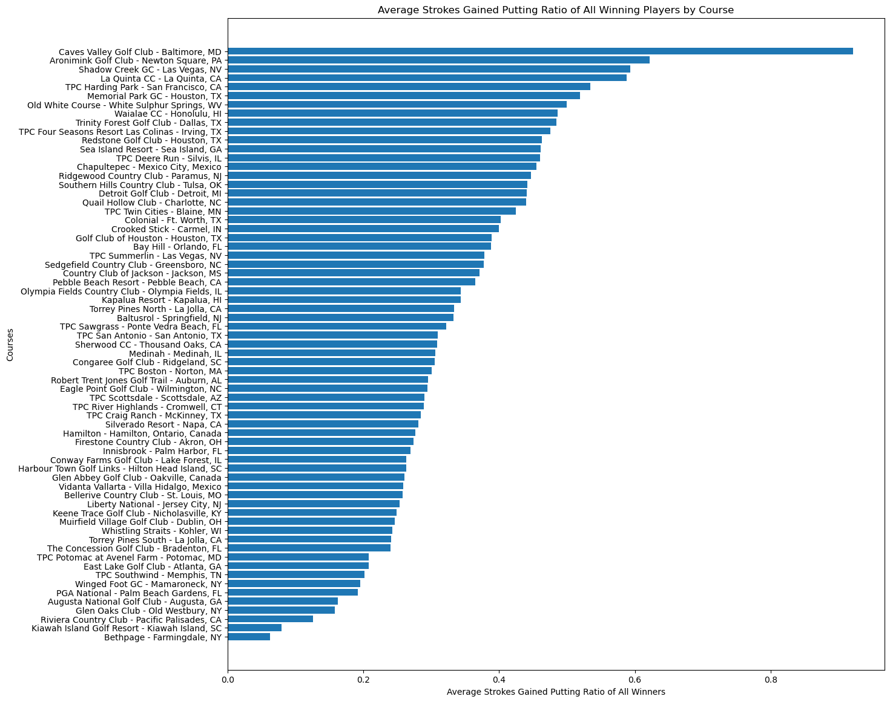

# Exploratory Data Analysis of PGA Tour Data: Revealing Insights and Patterns within the Game of Golf

**Author:** Stefan Jenss

--------------------

## Project Description

This exploratory data analysis (EDA) explores the raw data from all Professional Golf Association (PGA) Tour tournaments between the 2015 - 2022 seasons to discover trends and insights into the game of professional golf and which factors might influence a player's success on the tour.

--------------------

## Table of Contents
- **1. Introduction**
    - 1.1 Project Overview and the Basics of Golf
        - 1.1.1 Strokes Gained Measurements
    - 1.2 Personal Importance of this EDA
    - 1.3 Project Hypotheses & Hunches
- **2. Explaination of PGA Tour Dataset**
    - 2.1 Data Source
    - 2.2 Data Cleaning Process
        - 2.2.3 Data Cleaning Steps
    - 2.3 PGA Tour Data Dictionary
- **3. PGA Tour Data Analysis Results**
    - 3.1 Overview of Datasets
    - 3.2 Hypothesis #1 Testing *(Which aspects of the game are most important)*
        - 3.2.1 PairGrid Plot of Finishing Position vs. Strokes-Gained Metrics
        - 3.2.2 Correlation Heatmap Matrices of Finishing Position vs. Strokes Gained Metrics
    - 3.3 Hypothesis #2 Testing *(Does experience matter? On which courses does it matter?)*
        - 3.3.1 Side-by-Side Boxplots of Players with Different Experience Levels for 2022 Season
        - 3.3.2 Bar Graph of Total Round Played on Course Prior to Win in 2022 Season
        - 3.3.3 Bar Graph of Average Rounds Played on Course Prior to Top-5 Finish in 2022 Season
        - 3.3.4 Bar Graph of Average Rounds Played on Course Prior to Top-10 Finish in 2022 Season
    - 3.4 Hypothesis #3 Testing *(On which courses does putting matter the most?)*
        - 3.4.1 Bar Graph of Average "Strokes Gained Putting Ratio" of the Tournament Winners on Each Course
- **4. PGA Tour Data Analysis Summary**
    - 4.1 Overall Project Summary
    - 4.2 Challenges Faced
    - 4.3 Conclusions
    - 4.4 Possible Next Steps

--------------------

## 1. Introduction

### 1.1 Project Overview and the Basics of Golf

I conducted an exploratory data analysis (EDA) on a raw dataset of PGA Tour Golf. The dataset covers all the rounds played by every golfer in all the tournaments held between the professional seasons of 2015 and 2022. My aim for this analysis was to gain insights into which aspects of players’ golf games most impact their performance in tournaments. Additionally, I aimed to identify characteristics of various courses on the PGA Tour schedule, such as determining which courses favor golfers with more course experience and the courses where putting plays a crucial role in contending in the tournament.

***
Note: If you have background knowledge of the game of golf, please feel free to skip to the next section at this point.
***

If you're not familiar with the game of golf, it's an individual sport where players use different clubs to hit a golf ball into a 4.5" **hole**, usually placed hundreds of yards away from the starting point—or the **tee box**. Each time a player hits the ball with a club, it's called a **stroke**. The sole objective of golf is to get the ball in the hole in the least number of **strokes** possible. The number of **strokes** it takes to get the ball in the hole is compared to the **par** of the hole. **Par** is the expected number of strokes it takes for a proficient golfer to get the ball in the hole. A full **round** of golf has 18 holes, with each hole ranging from par 3 to 5 and the entire round usually being between par 69 and 73. If a player consistently scores the same as the course's par, they're considered a **"scratch"** or 0-handicap golfer.

PGA Tour Golf tournaments are played over four consecutive days (Thursday through Sunday), and for most tournaments, there is a **cut** after the second round before the weekend. The **cut** consists of the top ~70 players advancing to the final two rounds, with the rest of the field being eliminated from the tournaments. Players who don’t make the cut don’t get to compete during the weekend and don’t earn any prize money. 

#### 1.1.1 Strokes Gained Measures

Like many other sports, golf generates a plethora of data regarding player performance, making it an ideal c
andidate for data analysis. One of the gold standards for golf statistics is a measure called **strokes gained**. **Strokes gained** is a widely accepted standard in golf statistics that evaluates the number of strokes a golfer gains or loses in a specific area of their game when compared to other players of similar skill levels. For instance, on the PGA Tour, the pool of players used for comparison is those competing in the tournament. Strokes gained statistics measure various aspects of a player's game, including driving, approach shots, shots around the green, putting, and more. This statistic provides valuable insights to golfers, enabling them to identify their strengths and weaknesses and pinpoint key areas for improvement.

Below is a description of each of the strokes gained measurements that will be included in this analysis:

- **Strokes gained - putting**: this is the measure of how many strokes a player gains or loses on the putting green. It is calculated by comparing the player’s actual number of putts to the expected number of putts based on the initial distance the player has to the hole.

- **Strokes gained - around the green:** this is the measure of how many strokes a player gains or loses on shots that are typically within 30 years of the edge of the green. This does not include putting on the green.

- **Strokes gained - approaching the green:** this is the measure of how many strokes a player gains or loses on shots that are not the tee shot on par 4 and 5s, and the tee shots on par 3s.

- **Strokes gained - off the tee:** this is the measure of how many strokes a player gains or loses on shots off the tee on par 4s and 5s.
- **Strokes gained - tee to green:** this is the measure of how many strokes a player gains or loses on all shots that were taken from the tee box until the ball reaches the green.

### 1.2 Personal Importance of this EDA

I choose to analyze a PGA Tour golf dataset because of my passion for the sport. I enjoy both watching and playing golf, and one of the things that fascinates me about the sport is the way it blends art and science. The game demands a great deal of skill and imagination while also allowing for thorough analysis to enhance your performance.

### 1.3 Project Hypotheses & Hunches

I have several hypotheses for this EDA, including the following:

**Hypothesis #1:** When it comes to winning professional golf tournaments, certain aspects of a player’s game are more essential than others. Specifically, there are particular strokes gained measurements that have a more significant impact on a player’s overall performance in a tournament.

- **Hunch:** There will be specific strokes gained measurements that are more important in predicting a player’s overall performance in a tournament. Further, the more important strokes gained measurements will be revealed to be strained gained - putting and strokes gained - approach to the green.
    - *Strokes gained - putting*: Putting is a critical component of golf, and a player's score can be severely impacted by poor putting, regardless of how well they hit the ball off the tee or in the fairways. Therefore, it is anticipated that putting will be a significant factor in determining a player’s overall performance in a tournament.
    - *Strokes gained - approach to the green:* During a hole, the approach shot is one of the most important shots as it determines the distance a player will be putting to the hole. This, in turn, heavily impacts a player's chances of shooting above or below par.

**Hypothesis #2:** Golfers with more course experience will perform better, and there are specific courses on the PGA tour schedule that reward players with the most experience on that course. 

- **Questions:** Do players with more course experience perform better? And which courses reward experience the most? In other words, which courses do players who have played the course multiple times perform the best on?
- **Hunch:** There will be specific golf courses in which players with more experience tend to excel more. Golf courses vary greatly from one another, and I believe that the more a player is familiar with the nuances of the course, the better they will perform. However, I am unable to predict which specific courses on the PGA tour schedule will favor experience the most.

**Hypothesis #3:** There are specific courses on the PGA tour schedule in which it is important to be “hot with the putter” (have high strokes gained - putting statistic). 

- **Hunch:** The difficulty of putting greens varies greatly from course to course, so I believe there will be courses that benefit those players who are “hot with the putter” the most. However, I am unable to predict which specific courses these will be.

--------------------

## 2. Explaination of PGA Tour Dataset

### 2.1 Data Source

The data used for the analysis was initially obtained from advancedsportsanalytics.com, which is now offline. However, the dataset is still available thanks to a Kaggle.com user who has uploaded it. The dataset can be accessed through the following link:

https://www.kaggle.com/datasets/robikscube/pga-tour-golf-data-20152022

### 2.2 Data Cleaning Process

Upon my first examination of the dataset, I observed that several of the earlier tournaments lacked strokes gained data. To avoid omitting important data from these tournaments in my analysis of course experience, I decided to create two separate DataFrames for my analysis. One of the DataFrames excluded tournaments without strokes gained information, while the other included a value of 0 for all missing strokes gained data. This way, I could still analyze the other relevant data from those tournaments.

Below is the information from the original dataset:

#### 2.2.3 Data Cleaning Steps

1. **Dropping Empty Variables:** To begin cleaning the data, I removed variables that held no valuable information. These variables were "Unnamed: 2", "Unnamed: 3", and "Unnamed: 4". After careful inspection, I confirmed that they contained no useful information and proceeded to drop them from the dataset.

2. **Dropping Undesired Variables:** Furthermore, all variables containing DKP, FDP, and SDP information were not necessary in the final dataset. This was due to the unavailability of the advancedsportsanalytics.com website, which made it difficult for me to determine the meaning of these variables. Therefore, after examining the DKP, FDP, and SDP variables to ensure that they did not contain any valuable information, I removed them from the dataset. The variables that were removed include:
    - hole_DKP, hole_FDP, and hole_SDP
    - streak_DKP, streak_FDP, and streak_SDP
    - finish_DKP, finish_FDP, and finish_SDP
    - total_DKP, total_FDP, and total_SDP
    
    
3. **Identifying and Changing Identifying Variables:** Next, I identified all of the identifying variables and changed them to string objects. These variables included:
    - Player_initial_last
    - player
    - player id
    - tournament name
    - tournament id
    - course
    - season
    
    
4. **Addressing Missing Values in Full Dataset**: 
    - For some of the data, players who did not receive a valid finishing position either received a ‘pos' (finishing position) value of 999.0 or NaN. To fix this issue, the .replace() function was used to replace "999.0" with "0”. Additionally, the .fillna() function was used to replace NaN values with "0".
    - For all of the older tournaments that were missing strokes gained statistics, I still wanted to include those players' rounds in the course experience data analysis, so I changed all the "NaN” strokes gained values to "0.”
    - In the dataset, there are two variables that represent the players' finishing position in the tournament: "Finish" and "pos." The "Finish" variable is a string object because it contains a "T” if there was a tie for that position (i.e., T20). On the other hand, the "pos" variable was just the numerical finishing position of the player, and this was a floating-point variable. Upon inspection of the remaining nulls, I identified that for some of the older tournaments, the "Finish" value was missing, while the "pos" value was present. Therefore, to address these nulls in the "Finish" variable, I used .fillna(pga_clean[’pos']) to fill the nulls with the corresponding value of the finishing position.
    
    
5. **Creating New Strokes Gained DataFrame:** For the data analysis involving strokes gained data, I did not want to include the tournament in which strokes gained data was missing. Therefore, I created a new strokes gained dataset. I achieved this by first identifying all the tournaments that had strokes gained data. This was done by calculating the average total strokes gains for each tournament. If a tournament had a non-zero total strokes gained average, this meant that the tournament contained strokes gained data, and I included this tournament in the list of tournaments to include in the strokes gained dataset. Finally, to create a strokes gained dataset, I simply remade the original dataset, but only included instances with tournament IDs that match those on the list of tournaments with strokes gained data, and then repeated the steps to address and drop all nulls.

6. **Creation of “total rounds” and “course experience” variables**: To answer the course experience question, I decided to analyze the 2022 season using data from the 2015 to 2021 seasons to determine the players' experience with the courses during the 2022 season. To do this, I created a new DataFrame containing two new variables.
    - The first was “total rounds,” which represented the total number of rounds the player has previously played on that course between the 2015 to 2021 seasons.
        - To create these variables, I created a new dataset that excluded data from the 2022 season. Then, I created a DataFrame containing a variable for the total number of rounds a player has completed on a given course. I achieved this by grouping by "player" and "course" and then using the .sum() function.
    - The second variable was "course experience," which assigned each player in the 2022 season a course experience label. The three labels were "Experienced" (having played more than 16 rounds on the course), "Knowledgeable" (having played between 5 and 15 rounds on the course), and "Novice” (having played 4 or fewer rounds on the course).
        - I created this variable within the DataFrame by running the entire DataFrame through the following function:
        
        
        
        - Finally, I created a DataFrame of only the 2022 season and merged the total rounds information into this DataFrame.

### 2.3 PGA Tour Data Dictionary

| Variable              | Description | Data Type |
| --- | --- | --- |
| Player_initial_last   | Initial of player's first name and their full last name | string |
| player                | The player's full name | string |
| player id             | A unique ID assigned to each individual player | string |
| tournament name       | The name of a tournament | string |
| tournament id         | A unique ID assigned to each individual tournament | string |
| course                | The name of the course the tournament is being played at | string |
| date                  | The date the tournament is being played | string |
| season                | The year the tournament is being played | string |
| purse                 | The total prize money available for the tournament | float |
| hole_par              | The number of stroke expected for a player to get throughout tournament | integer |
| strokes               | The actual number of stroke the player had over the course of a tournament | integer |
| n-rounds              | The number of golf round a player completed in a tournament | integer |
| made_cut              | Whether a player made the cut after the second round to continue onto the weekend rounds | integer |
| Finish                | The position a player finished in a tournament (indicates whether they tied for that position) | string |
| pos                   | The numerical position a player finished (exclusing whether they tied for that position) | float |
| no_cut                | Whether or not the event included a cut after the first two days | integer |
| sg_putt               | Strokes gained: putting | float |
| sg_arg                | Strokes gained: around the green | float |
| sg_app                | Strokes gained: approach the green | float |
| sg_ott                | Strokes gained: off the tee | float |
| sg_t2g                | Strokes gained: tee to green | float |
| sg_total              | The total strokes gained over the round | float |
| total round           | The total number of rounds a player has completed on a given golf course between the 2015 and 2021 season to be used as a reference for their performance in the 2022 season | integer |
| course experience     | The label assigned to a player in the 2022 season based on the experience they had with the course between the 2015 and 2021 seasons | string |

--------------------

## 3. PGA Tour Data Analysis Results

### 3.1 Overview of Datasets

**There are three datasets that resulted from the data cleaning process:**
1. **pga_clean**: this is the PGA Tour data that includes all the player-tournament information, even those without strokes gained information.
2. **pga_sg**: this is only the PGA Tour data that includes the strokes gained data for each player in the tournament.
3. **season_2022_exp**: this dataset as the player course experiencing data.

**<u>`.info()` for pga_clean dataset</u>**

| Column               | Non-Null Count | Dtype   |
| -------------------- | -------------- | ------- |
| Player_initial_last  | 36864          | object  |
| tournament id        | 36864          | int64   |
| player id            | 36864          | int64   |
| hole_par             | 36864          | int64   |
| strokes              | 36864          | int64   |
| n_rounds             | 36864          | int64   |
| made_cut             | 36864          | int64   |
| pos                  | 36864          | float64 |
| player               | 36864          | object  |
| tournament name      | 36864          | object  |
| course               | 36864          | object  |
| date                 | 36864          | object  |
| purse                | 36864          | float64 |
| season               | 36864          | int64   |
| no_cut               | 36864          | int64   |
| Finish               | 36864          | object  |
| sg_putt              | 36864          | float64 |
| sg_arg               | 36864          | float64 |
| sg_app               | 36864          | float64 |
| sg_ott               | 36864          | float64 |
| sg_t2g               | 36864          | float64 |
| sg_total             | 36864          | float64 |
| Data columns (total 22 columns)                 |
| dtypes: float64(8), int64(8), object(6)         |

**<u>`.info()` for pga_sg dataset</u>**

| Column               | Non-Null Count | Dtype   |
| -------------------- | -------------- | ------- |
| Player_initial_last  | 29180          | object  |
| tournament id        | 29180          | int64   |
| player id            | 29180          | int64   |
| hole_par             | 29180          | int64   |
| strokes              | 29180          | int64   |
| n_rounds             | 29180          | int64   |
| made_cut             | 29180          | int64   |
| pos                  | 29180          | float64 |
| player               | 29180          | object  |
| tournament name      | 29180          | object  |
| course               | 29180          | object  |
| date                 | 29180          | object  |
| purse                | 29180          | float64 |
| season               | 29180          | int64   |
| no_cut               | 29180          | int64   |
| Finish               | 29180          | object  |
| sg_putt              | 29180          | float64 |
| sg_arg               | 29180          | float64 |
| sg_app               | 29180          | float64 |
| sg_ott               | 29180          | float64 |
| sg_t2g               | 29180          | float64 |
| sg_total             | 29180          | float64 |
| Data columns (total 22 columns)                 |
| dtypes: float64(8), int64(8), object(6)         |

**<u>`.info()` for season_2022_exp dataset</u>**

| Column                 | Non-Null Count  | Dtype   |
| ---------------------- | --------------  | ------- |
| player                 | 2566            | object  |
| course                 | 2566            | object  |
| previous total rounds  | 2566            | int64   |
| course experience      | 2566            | object  |
| Player_initial_last    | 2566            | object  |
| tournament id          | 2566            | int64   |
| player id              | 2566            | int64   |
| hole_par               | 2566            | int64   |
| strokes                | 2566            | int64   |
| n_rounds               | 2566            | int64   |
| made_cut               | 2566            | int64   |
| pos                    | 2566            | float64 |
| tournament name        | 2566            | object  |
| date                   | 2566            | object  |
| purse                  | 2566            | float64 |
| season                 | 2566            | int64   |
| no_cut                 | 2566            | int64   |
| Finish                 | 2566            | object  |
| sg_putt                | 2566            | float64 |
| sg_arg                 | 2566            | float64 |
| sg_app                 | 2566            | float64 |
| sg_ott                 | 2566            | float64 |
| sg_t2g                 | 2566            | float64 |
| sg_total               | 2566            | float64 |
| Data columns (total 24 columns)                    |
| dtypes: float64(8), int64(9), object(7)            |

### 3.2 Hypothesis #1 Testing *(Which aspects of the game are most important)*

**Question:** What aspect of a player's golf game is the most important predictor of whether or not they perform well in a tournament?

#### 3.2.1 PairGrid Plot of Finishing Position vs. Strokes-Gained Metrics

I first created a PairGrid plot containing pair plots and kernal density estimate (KDE) plots to visually analyze which strokes gained variables are most related to the players' finishing positions.

*** Important note: ***

- When examining the strokes gained variables, the strongest correlation will be found between "strokes gained: total" and finishing position. This is because the winner of the tournament will have a score that deviates furthest from the mean in the negative direction, resulting in the highest number of strokes gained compared to the rest of the field.

*** Key takeaways: ***

- When determining which aspects of a player's game are the most important predictor of whether they perform well in a tournament, we are most interested in the top row of the PairGrid, and the leftmost column of the PairGrid.
    
- For the top row of kernel density estimate (KDE) plots, the top performing players are those towards the bottom of the graph, so we want to see which variables have the most negative relationship.
    
    - Upon observation of the top KDE plots (disregarding the st_total variables), the other two variables that seem to have the greatest negative correlation with finishing position are “sg_app” (Strokes Gained - Approach) and “sp_t2g” (Strokes Gained - Tee to Green).
    
- “Strokes Gained - Approach” and “Strokes Gained -Tee 2 Green” being the most important indicators of a player's performance in a golf tournament is also supported by the following plots:
    
    - Strokes Gained - Approach x Strokes Gained - Total (both scatter and KDE plots)
        - Since the best-performing players will have the highest “Strokes Gained - Total”, since these two variable appears to be positively correlated with one another, this indicates that “Strokes Gained - Approach” is an important indicator of a player’s overall performance.
    
    - Strokes Gained - Tee to Green x Strokes Gained - Total (both scatter and KDE plots)
        - For the same reason as stated above, the positive correlation between “Strokes Gained - Tee to Green” and “Strokes Gained - Total” indicates that “Strokes Gained - Tee to Green is an important indicator of a player’s overall performance.
    
- Further, we observe the relationship between “Strokes Gained - Tee to Green” and the other strokes gained variables, we see that ‘Strokes Gained - Tee to Green” has the strongest positive correlation with “Strokes Gained - Approach.” This indicates that how a player is performing with their approach shots strongly contributes to their “Stroked Gained - Tee to Green” and their overall success in tournaments.

#### 3.2.2 Correlation Heatmap Matrices of Finishing Position vs. Strokes Gained Metrics

Next, I created a correlation heatmap matrices to analyze the correlations between the different strokes gained statistics and the players' finishing positions.

*** Key takeaways: ***

- The results of the heatmap of the correlation matrix confirm the findings from the PairGrid plots:
    - Strokes Gained - Tee to Green has a moderately strong correlation with finishing position (-0.67) and Strokes Gained - Total (0.77).
    - Strokes Gained - Approach has a moderate correlation with finishing position (-0.48) and Strokes Gained - Total (0.56).
    - Strokes Gained - Approach has a moderately strong correlation with Strokes Gained - Tee to Green (0.73), indicating the important contribution that approach shots have to Strokes Gained - Tee to Green
- **New finding:** The heatplot further revealed that “sg_putt” (Strokes Gained - Putting) is almost equally as correlated with finishing position as Strokes Gained - Approach is (-0.43 vs -0.48).

### 3.3 Hypothesis #2 Testing *(Does experience matter? On which courses does it matter?)*

**Question:** Do PGA Tour players with more experience perform better than those with less? And are there specific courses on the PGA Tour schedule that reward golfers with more course experience?

#### 3.3.1 Side-by-Side Boxplots of Players with Different Experience Levels for 2022 Season

First, I generated side-by-side boxplots of player course experience and finishing position to see if the distributions show any meaningful difference.

*** Impression: ***

- In general, experienced and knowledgeable golfers tend to perform slightly better than novice players; however, the difference in the distribution is not significant.

- Out of the three categories, experienced golfers tend to perform the best. This is expected, as in most sports (up until a certain point) the more time they have to improve and understand their game, the better they will perform. However, it is important to note that there is little difference in distribution between the experienced and knowledgeable golfers.

#### 3.3.2 Bar Graph of Total Round Played on Course Prior to Win in 2022 Season

Secondly, I created a bar graph that shows the total number of rounds the previous winners had played on the course prior to them winning there in the 2022 season.

*** Impression: ***

- When just considering the winners of the tournaments, the top 5 courses that most favor course experience are:
    1. Pebble Beach Resort
    2. Muirfield Village Golf Club
    3. La Quinta CC
    4. Torrey Pines North
    5. Waialae CC

#### 3.3.3 Bar Graph of Average Rounds Played on Course Prior to Top-5 Finish in 2022 Season

I then repeated step two, but instead of just including the golfers who won the tournament, I included the average total previous rounds played of all the players who placed 5th or above. 

*** Impression: ***

- When considering the average previous total rounds played among players finishing 5th or above, the top 5 courses that favor course experience are:
    1. Pebble Beach Resort 
    2. Torrey Pines North
    3. Waialae CC
    4. La Quinta CC
    5. Albany - New Providence
    
    In this list, Pebble Beach Resort remains the top course that favors course experience. The only course that difference between these two lists are that Muirfield Village Golf Club moves out of the top 5 down to 15th, and Albany - New Providence is the new 5th.

#### 3.3.4 Bar Graph of Average Rounds Played on Course Prior to Top-10 Finish in 2022 Season

I repeated this, again, for all players who place 10th or above to see how the results change when including a larger sample of the top performing golfers.

*** Impression: ***

- When considering the average previous total rounds played among players finishing 5th or above, the top 10 courses that favor course experience are:
    1. Pebble Beach Resort
    2. TPC Scottsdale
    3. Torrey Pines North
    4. Waialae CC
    5. Colonial
    
    In this list, Pebble Beach Report remains the top course that favors course experience. The courses that remain from the first two lists are Pebble Beach Report, Torrey Pines North, and Waialae CC. The new courses that enter the top 5 are TPC Scottsdale and Colonial.

### 3.4 Hypothesis #3 Testing *(On which courses does putting matter the most?)*

**Question**: On which courses is it most important to be "hot with the putter?" In other words, on which courses is it most important to be putting well in order to be in contention to win?

#### 3.4.1 Bar Graph of Average "Strokes Gained Putting Ratio" of the Tournament Winners on Each Course

**<u>Approach:</u>**

1. Calculate the average of the “Strokes Gained Putting Ratio” of all the players that have won tournaments on each course.
    - Strokes Gained - Putting alone is not a good indicator of how important it is to be “hot with the putter” on a given golf course, because courses with easy greens will likely have winners with very high Strokes Gained Putting.
        - Therefore, the approach I’m going to take is to calculate the “Strokes Gained Putting Ratio”, which will be the ratio of Strokes Gained - Putting to Strokes Gained - Total, since Strokes Gained - Total is the indicator of the player's overall performance.
        - Ultimately, the “Strokes Gained Putting Statistic” is an indicator of how much the player’s putting contributed to them winning the tournament. It is logical to assume that on putter-intensive courses, the winner’s putting will have to contributing significantly to their overall performance.
2. Sort the list of “Average Strokes Gained Putting Ratios of All Winning Players by Course” to determine which courses historically have had winners with the highest Strokes Gained  Putting Ratio statistic.

*** Impression: ***

In the 2015 to 2022 PGA Tour seasons, the courses where being “hot with the putter” has been most important have been:

1. Caves Valley Golf Club
2. Aronimink Golf Club
3. Shadow Creek GC
4. La Quinta CC
5. TPC Harding Park
6. Memorial Park GC
7. Old White Course
8. Waialae CC
9. Trinity Forest Golf Club
10. TPC Four Seasons Resort Golf Club

--------------------

## 4. PGA Tour Data Analysis Summary

### 4.1 Overall Project Summary

The aim of this exploratory data analysis on PGA Tour data was to gain insight into which aspects of the professional golf game are most important in being a top competitor and to identify trends within the PGA Tour schedule that can help us better understand the courses that are played and whether specific courses favor or require different things, such as course experience or quality putting. This project required extensive cleaning of the PGA Tour Raw Dataset generated by advancedsportsanalytics.com, and the tailoring of variables to best suit the desired analysis. After the cleaning process was complete, multiple analytical methods were used to analyze both player and tournament data, such as pair plots, kernel density estimate (KDE) plots, correlation heatmap matrices, box plots, and bar charts. This analysis ultimately provided valuable insight into which strokes gained metrics are the most crucial, which tournaments on the PGA tour schedule most favor players with course experience, and on which courses putting is most important.

### 4.2 Challenges Faced

The biggest difficulty when working with this dataset was that the original source for the dataset ([advancedsportsanalytics.com](http://advancedsportsanalytics.com/)) is no longer a working website, and as a result, I was unable to read any description of the dataset or what the reasoning was behind some of the variables that were included. For example, the DKP, FDP, and SDP variables were specific to this dataset, and I didn’t know what they represented. So even though they did not matter for the question I was trying to answer, it would have been convenient to know what these variables represented.

An additional challenge I faced when working with this dataset was that much of the analysis I was performing involved the strokes gained variables. However, there were many tournaments where this information was not included. I was able to work around this obstacle by creating two datasets, one with only the player-tournament information that included strokes gained data, and another with all the player-tournament information with zeros in place for any null strokes gained data.

### 4.3 Conclusions

There were three main conclusions drawn from this data analysis:

1. The most important aspects of a professional golfer’s game are the following (in order):
    1. **Strokes gained - tee to green**
    2. **Strokes gained - approaching the green**
    3. **Strokes gained - putting**
    Additionally, a player’s strokes gained - tee to green was most affected by strokes gained - approaching the green. This indicates that a player’s approach game is more important to their overall performance than their performance off the tee and around the green.
2. Over the course of a season, a player’s course experience is not strongly correlated with their performance in tournaments. However, there were specific courses on the PGA Tour 2022 schedule that favored players with course experience. These courses were **Pebble Beach Resort**, **Torrey Pines North**, and **Waialae CC**. Other notable courses that favored players with greater course experience were **Augusta National Golf Club** and **TPC Sawgrass**.
3. The top five courses in which it is most important for players to be performing well with the putter are **Caves Valley Golf Club, Aronimink Golf Club, Shadow Creek GC, La Quinta CC,** and **TPC Harding Park**.

### 4.4 Possible Next Steps

There are endless possibilities for the analysis that could be performed on the data produced by PGA Tour golfers. Some possible next steps to continue the work of this analysis of the PGA Tour dataset could be to analyze individual seasons, individual tournaments, or individual players. For example, it would be interesting to group all the tournament results by course and see which strokes gained measures are most important for each course. A potential application of such analysis could be that if players knew which aspects of the golf game were most important for each course they are playing on, they could focus their practice the week before tournaments on those courses to strengthen that specific aspect of their game and hopefully have a better chance of competing for a win.

Additionally, for individual players of interest, further analysis could be performed to analyze their performance over time and to identify trends in their performance, such as during which time of the season they typically perform the best and on which courses best suit their game.

The possibilities and depth of the analysis that can be performed on the data produced by golf are endless and can provide value to both the players and those who love watching the game. Looking forward, I am excited to explore more data while growing my love for the game of golf as my data analysis skills grow and develop.