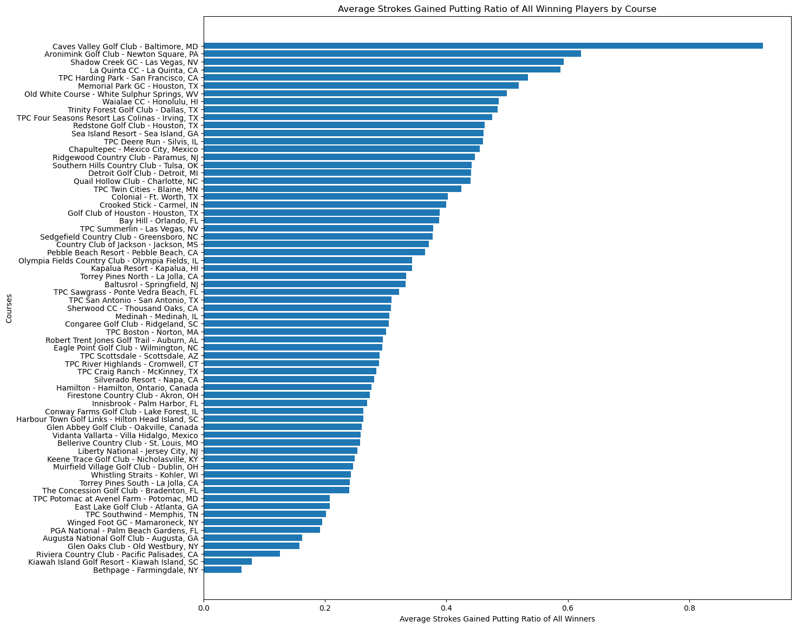

# Stefan Jenss's Data Science Project Portfolio

A collection of data science projects that I have completed during my studies at Northwestern University as a Masters in Data Science student, and on my own for personal interest.

## Projects

### 1. **PGA Tour Exploratory Data Analaysis (EDA)**:

This exploratory data analysis (EDA) explores the raw data from all Professional Golf Association (PGA) Tour tournaments between the 2015 - 2022 seasons to discover trends and insights into the game of professional golf and which factors might influence a player's success on the tour.

    
    
    

